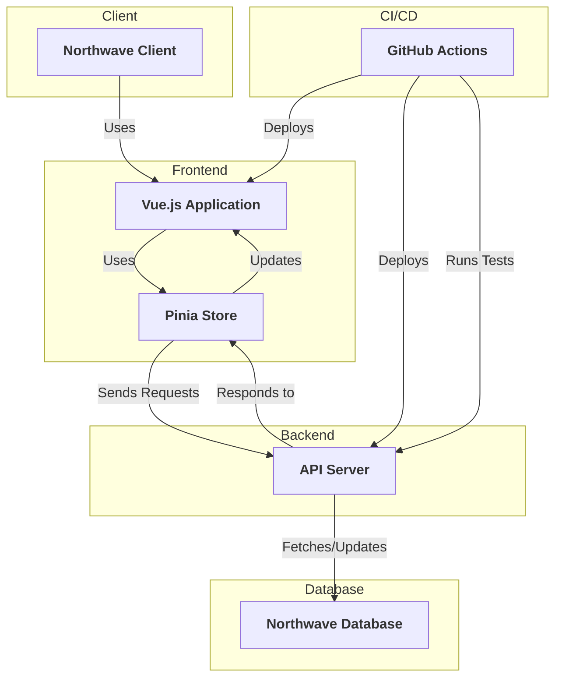

# Development of a vue.js web application in a team of 8 students, for the Northwave company.

## Introduction

In the context of the Software Engineering course at Radboud University, we have developed a web application for the Northwave company, called Northwash. The goal of this project was to develop a web application that allows Northwave to manage their security incidents. The application should allow Northwave to go through the entire incident management process for their clients. This application is a real-time collaborative tool that allows Northwave to manage their incidents in a more efficient way. 

The project repository is confidential so I cannot show the code here. However, I can provide a detailed description of the project and the technologies used. There is also a small part of the video presentation of the project that I can share.

## Objectives

The objectives of this project were to develop a web application that allows Northwave to manage their security incidents. The application should allow Northwave to go through the entire incident management process for their clients. The application should be a real-time collaborative tool, which looks like an Excel sheet, that allows Northwave to manage their incidents in a more efficient way.

## Technologies

We used the following technologies to develop the web application:

Git
: Git is a version control system that allows us to collaborate on the project. We used Git to manage the source code of the web application and to collaborate with the team. We used Git branches to work on different features of the web application and to merge our changes together. We used Git tags to mark important milestones in the project. We used Git pull requests to review and merge our changes.

Vue.js
: Vue.js is a JavaScript framework for building user interfaces. We used Vue.js to build the front-end of the web application. Vue.js allows us to create interactive web interfaces with ease.

javascript
: JavaScript is a programming language that allows us to add interactivity to the web application. We used JavaScript to add dynamic behavior to the web application and to make it more user-friendly. We used javascript to interact with the back-end API and to update the state of the application.

Vite.js
: Vite.js is a build tool for modern web development. We used Vite.js to build the web application. Vite.js provides a fast development server and a build tool that allows us to build the web application quickly.

Bootstrap
: Bootstrap is a front-end framework for building responsive web interfaces. We used Bootstrap to style the web application and to make it responsive. Bootstrap provides a set of CSS classes that we can use to style the web application.

Pinia Store
: Pinia is a Vue.js store that allows us to manage the state of the application. We used Pinia to manage the state of the web application and to share data between components. The Pinia store was communicating with the back-end API to fetch and update data.

Cypress
: Cypress is an end-to-end testing framework for web applications. We used Cypress to write automated tests for the web application. Cypress allows us to write tests that simulate user interactions with the web application. We used Cypress to test the functionality of the web application and to ensure that it works as expected.

CI/CD
: We used GitHub Actions to set up a continuous integration and continuous deployment pipeline for the web application. We used GitHub Actions to run automated tests on the web application and to deploy it to a staging environment. We used GitHub Actions to automate the deployment process and to ensure that the web application is always up-to-date.

## Development Process

We used the Agile methodology to develop the web application. The project was divided into three sprints over the semester, each focusing on different features of the web application. We adhered to the Scrum framework to manage these sprints and organize our work effectively.

### Sprint Planning and Features

At the beginning of each sprint, we held a sprint planning meeting to define the goals and tasks for the upcoming sprint. We used user stories to describe the features and functionalities that needed to be implemented. These user stories were written from the perspective of the end-users to ensure that the development aligned with user needs and provided clear, actionable tasks for the team.

### Daily Stand-Up Meetings

We held stand-up meetings twice a week to discuss the progress of the project and to plan the work for the next few days. During these meetings, each team member answered the following questions:

- **What did you do since the last meeting?**
- **What are you planning to do before the next meeting?**
- **Are there any blockers or impediments in your way?**

### Scrum Framework and Tools

We used Jira to manage the project and track the progress of our work. Jira allowed us to create and assign tasks, track their completion, and visualize our progress on a Kanban board. This helped in maintaining transparency and ensuring that everyone was on the same page regarding the project status.

### Sprint Review and Retrospective

At the end of each sprint, we conducted a sprint review meeting to showcase the work completed during the sprint. This meeting provided an opportunity to gather feedback from stakeholders and make necessary adjustments for future sprints.

Following the sprint review, we held a sprint retrospective meeting to reflect on the sprint process. The team discussed what went well, what could be improved, and how we could implement changes to enhance our workflow in the next sprint.

### Additional Agile Practices

User Story Mapping
: We used user story mapping to visualize the user journeys and prioritize features that delivered the most value.

Planning Poker
: To estimate the effort required for each user story, we used the Planning Poker technique. This helped in reaching a consensus on task estimations and identifying potential challenges early.

Continuous Integration
: We set up a continuous integration pipeline to automatically test and deploy code changes. This ensured that the application remained stable and functional throughout the development process.

### Meetings with the Client

We had regular meetings with the client to discuss the project requirements, gather feedback, and ensure that the development aligned with the client's expectations. These meetings helped in maintaining clear communication and ensuring that the project was on track to meet the client's needs. We also went to the Northwave office to present the advances of the project and to get feedback from the client. We had the oppurtunity to work on the project in the Northwave office.

## Project schema
    

## Video Presentation 

Here I present one part of the application, te different user roles and the functionalities related to roles and permissions. I also show the collaboration between users in real-time.



> Sorry for the quality of the video, it was recorded during a presentation in the Northwave office. Script was improvised so the English is not perfect.
{: .prompt-info }

## Conclusion

This project was a great opportunity to work on a real-world project and to apply the knowledge and skills acquired during the Software Engineering course. We learned how to work effectively in a team, manage a project using Agile methodologies, and develop a web application from scratch. The project provided valuable insights into the software development process and allowed us to gain practical experience in building a real-time collaborative tool. We are proud of the final product and believe that it will be beneficial for Northwave in managing their security incidents.