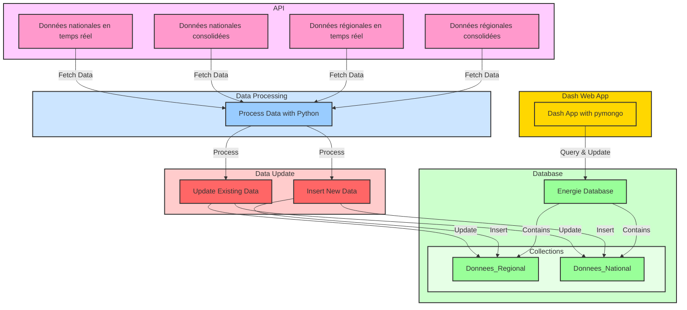

# Visualitions intéractives de grande quantité de données énergetiques avec Dash et MongoDB

## Introduction

Dans le cadre du cours de visualisation analytique, nous avons réalisé un projet de visualisation de données énergétiques de la France métropolitaine. Nous avons utilisé le framework Dash pour réaliser une application web permettant de visualiser de manière interactive les données énergétiques de la France métropolitaine. 

## Objectif

L'objectif de ce projet est de réaliser une application web permettant de visualiser de manière interactive les données énergétiques de la France métropolitaine.

## Présentation des Données

éCO2mix est un outil créé par RTE France afin de mieux connaître en temps réel l'électricité en France métropolitaine (hors Corse). RTE France met à disposition gratuitement sur le site Opendatasoft, les bases de données utilisée par éCO2mix qui fournissent les données de 2013 à aujourd'hui. Les informations fournient par les bases de données sont les suivantes :

- Consommation d’électricité en France métropolitaine (hors Corse) et prévisions calculées la veille et en début d’après-midi le jour J ;
- Production d’électricité française par filière en valeur et en pourcentage ;
- Échanges commerciaux d’électricité avec les 6 pays voisins ;
- Émissions de CO2 que génère la production d’électricité ;
- Données mensuelles à l’échelle régionale : consommation, production et flux interrégionaux.

Nous avons utilisé les données énergétiques de la France métropolitaine fournies par le site OpenDataSoft. Ces données sont disponibles en temps réel et consolidées. Nous avons utilisé les données en temps réel ainsi que les données consolidées pour réaliser notre application.

 Liste des API que nous avons utilisé pour récupérer nos données:
- [Données nationales en temps réel](https://odre.opendatasoft.com/api/explore/v2.1/catalog/datasets/eco2mix-national-tr)
- [Données nationales consolidées](https://odre.opendatasoft.com/api/explore/v2.1/catalog/datasets/eco2mix-national-cons-def)
- [Données régionales en temps réel](https://odre.opendatasoft.com/api/explore/v2.1/catalog/datasets/eco2mix-regional-tr)
- [Données régionales consolidées](https://odre.opendatasoft.com/api/explore/v2.1/catalog/datasets/eco2mix-regional-cons-def)

## Base de données

### Base de données MongoDB

Nous avons utilisé une base de données MongoDB pour stocker les données énergétiques de la France métropolitaine. Nous avons créé une base de données nommée "eco2mix" contenant 2 collections : "national" et "regional". La collection "national" contient les données nationales en temps réel et consolidées, tandis que la collection "regional" contient les données régionales en temps réel et consolidées. Nous avons utilisé la librairie pymongo pour interagir avec la base de données MongoDB.

Voici un schema de la base de données :

### Avantages de MongoDB

MongoDB est une base de données NoSQL qui offre de nombreux avantages. Voici quelques-uns des principaux avantages de MongoDB :

| Avantage                                                                                 | Description                                                                                                                                                                                                                     |
|------------------------------------------------------------------------------------------|---------------------------------------------------------------------------------------------------------------------------------------------------------------------------------------------------------------------------------|
| **Flexibilité des schémas**                                                              | MongoDB permet de stocker des données non structurées, ce qui signifie que vous pouvez avoir des documents avec des structures différentes dans la même collection. Cela offre une grande flexibilité dans la modélisation des données. |
| **Performances élevées**                                                                 | MongoDB est optimisé pour les opérations de lecture et d'écriture, ce qui en fait un choix idéal pour les applications nécessitant des performances élevées en temps réel.                                                        |
| **Scalabilité horizontale**                                                              | MongoDB supporte la réplication et le sharding, ce qui permet de distribuer les données sur plusieurs serveurs et de garantir la haute disponibilité et la scalabilité des applications.                                         |
| **Facilité d'utilisation**                                                               | MongoDB est très facile à installer, configurer et utiliser. Il offre une API intuitive et de nombreux outils de gestion, ce qui permet aux développeurs de se concentrer sur la logique métier plutôt que sur l'administration de la base de données.|
| **Richesse des fonctionnalités**                                                         | MongoDB offre de nombreuses fonctionnalités avancées telles que les agrégations, les transactions ACID multi-documents, les index géospatiaux, et bien plus encore, permettant de répondre à une variété de besoins applicatifs.  |
| **Communauté et support**                                                                | En tant que solution open source, MongoDB bénéficie d'une large communauté de développeurs et de nombreuses ressources en ligne, y compris des forums, des tutoriels et une documentation exhaustive.                             |
| **Coût économique**                                                                      | MongoDB est gratuit et open source, ce qui permet de réduire les coûts liés aux licences pour les projets de développement web, en particulier pour les startups et les petites entreprises.                                       |
| **Support natif des documents JSON**                                                     | MongoDB stocke les données dans un format BSON (Binary JSON), ce qui le rend très compatible avec les applications web modernes utilisant les données JSON.                                                                       |
| **Sécurité et contrôle des accès**                                                       | MongoDB offre des fonctionnalités robustes de sécurité, y compris le chiffrement des données, les contrôles d'accès basés sur les rôles (RBAC), et l'audit des opérations, garantissant la sécurité des données sensibles.         |
| **Intégration facile avec les frameworks et les langages de programmation**              | MongoDB offre des drivers officiels pour de nombreux langages de programmation (Python, Java, Node.js, etc.) et s'intègre facilement avec divers frameworks de développement web.                                                 |

Ces avantages font de MongoDB une base de données polyvalente et puissante, adaptée à une large gamme de cas d'utilisation dans le développement web et les applications en temps réel, y compris la gestion de données énergétiques.

## Architecture de l'Application

Ce schéma illustre l'architecture de notre application. Nous avons utilisé des API pour récupérer les données énergétiques de la France métropolitaine. Nous avons ensuite traité ces données avec Python pour les stocker dans une base de données MongoDB. Nous avons créé une application web Dash pour visualiser de manière interactive les données énergétiques stockées dans la base de données MongoDB.

## Application Web

Nous avons utilisé le framework Dash pour réaliser notre application web. Dash est un framework open source développé par Plotly qui permet de créer des applications web interactives en Python. Dash est basé sur Flask, Plotly.js et React.js, ce qui en fait un framework très puissant pour la création d'applications web interactives. Nous avons utilisé Dash pour créer une application web permettant de visualiser de manière interactive les données énergétiques de la France métropolitaine.

Voici une vidéo de démonstration de notre application web :

