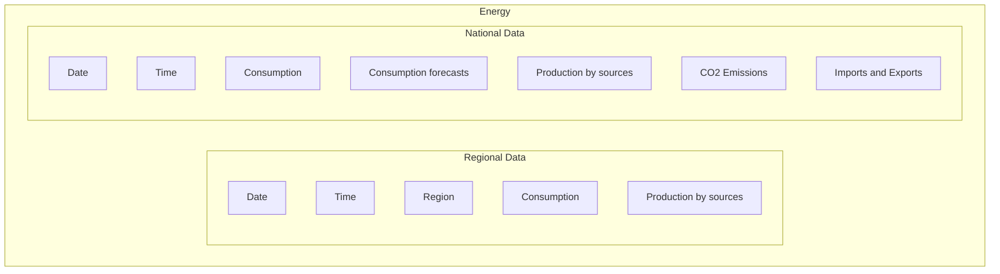
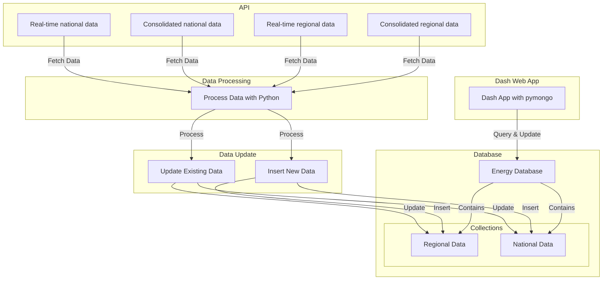

# Interactive Visualizations of Large Energy Data with Dash and MongoDB

## Introduction

As part of the **analytical visualization course**, we completed a project to visualize energy data from metropolitan France. We used the **Dash** framework to create a web application that allows interactive visualization of energy data from metropolitan France.

**GitHub Repository:**

[](https://github.com/Hisqkq/Projet-de-visualisation-M1){: .light .w-75 .shadow .rounded-10 w='1212' h='668' }

[](https://github.com/Hisqkq/Projet-de-visualisation-M1){: .dark .w-75 .shadow .rounded-10 w='1212' h='668' }

## Objective

The goal of this project is to develop a web application that allows for **interactive visualization of energy data** from metropolitan France.

## Data Overview

**éCO2mix** is a tool created by **RTE France** to better understand electricity in metropolitan France (excluding Corsica) in real-time. RTE France provides free access to the databases used by éCO2mix through the **Opendatasoft** platform, offering data from 2013 to the present. The information provided by these databases includes:

- Electricity consumption in metropolitan France (excluding Corsica) and forecasts calculated the day before and in the afternoon of the current day;
- French electricity production by energy source, in value and percentage;
- Electricity trade with the 6 neighboring countries;
- CO2 emissions generated by electricity production;
- Monthly data on a regional scale: consumption, production, and interregional flows.

We used **energy data** from metropolitan France provided by the **OpenDataSoft** platform. This data is available in real-time and as consolidated data. We used both real-time and consolidated data to build our application.

<div class="box-info" markdown="1">
<div class="title"> List of APIs we used to retrieve our data: </div>

- [Real-time national data](https://odre.opendatasoft.com/api/explore/v2.1/catalog/datasets/eco2mix-national-tr)
- [Consolidated national data](https://odre.opendatasoft.com/api/explore/v2.1/catalog/datasets/eco2mix-national-cons-def)
- [Real-time regional data](https://odre.opendatasoft.com/api/explore/v2.1/catalog/datasets/eco2mix-regional-tr)
- [Consolidated regional data](https://odre.opendatasoft.com/api/explore/v2.1/catalog/datasets/eco2mix-regional-cons-def)

</div>

## Database

### MongoDB Database

We used a **MongoDB** database to store the energy data for metropolitan France. We created a database named "eco2mix" containing **2 collections**: "national" and "regional." The "national" collection contains real-time and consolidated national data, while the "regional" collection holds real-time and consolidated regional data. We used the **pymongo** library to interact with the MongoDB database.

Here is a **schema of the database**:


```mermaid
graph TB
    subgraph Energy
        subgraph "Regional Data"
            A1[Date]
            A2[Time]
            A3[Region]
            A4[Consumption]
            A5[Production by sources]
        end
        
        subgraph "National Data"
            B1[Date]
            B2[Time]
            B3[Consumption]
            B4[Consumption forecasts]
            B5[Production by sources]
            B6[CO2 Emissions]
            B7[Imports and Exports]
        end
    end

```

### Advantages of MongoDB for Storing Energy Data

We chose **MongoDB** to store the energy data for our project due to its numerous advantages, which are particularly suited to the requirements of a real-time data visualization application.

<div class="box-tip" markdown="1">
<div class="title"> Advantages of MongoDB </div>

**1. Schema Flexibility:**
MongoDB allows managing semi-structured data, making it ideal for easily integrating different sources of energy data (national and regional) while allowing for adjustments over time without restructuring the database.

**2. Real-Time Performance:**
MongoDB is optimized for fast read and write operations, which is crucial for our application where energy data is updated in real time and needs to be immediately available for visualization.

**3. Horizontal Scalability:**
With its sharding capabilities, MongoDB allows data to be distributed across multiple servers, ensuring efficient scalability to handle the increasing amount of energy data over time.

**4. Easy Integration with Python:**
MongoDB's native integration with **Python**, through the **pymongo** library, simplifies data access and manipulation, making development smoother and data interaction more intuitive.

**5. JSON Document Support:**
MongoDB stores data in **BSON** (Binary JSON), facilitating its use with modern web applications and frameworks such as **Dash**, which rely on the JSON format for data transmission.

</div>

These characteristics make MongoDB an ideal solution for our project, providing a combination of flexibility, performance, and security, well-suited to the needs of a real-time interactive visualization application.

## Dash Framework

### What is Dash?

**Dash** is an open-source framework developed by **Plotly** that allows the creation of interactive web applications using **Python**. Dash is built on **Flask**, **Plotly.js**, and **React.js**, making it a powerful framework for creating interactive web applications. Dash allows the creation of interactive dashboards, charts, maps, diagrams, tables, and more, all using only Python code.

<div class="box-info" markdown="1">
<div class="title"> Why Did We Choose Dash? </div>

We chose **Dash** to build our web application for energy data visualization for several reasons:
- **Ease of Use:** Dash enables creating interactive web applications in Python without requiring knowledge of HTML, CSS, or JavaScript.
- **Interactivity:** Dash provides advanced features to make charts and dashboards interactive, which is essential for our application.
- **Integration with Plotly:** Dash is based on Plotly, a powerful online data visualization library, which allows us to create high-quality charts.
- **Flexibility:** Dash offers great flexibility to customize the appearance and behavior of the web application, allowing us to create a user interface tailored to our needs.

</div>

### Dash Callbacks

<div class="box-danger" markdown="1">

**Dash callbacks** are a key element of the interactivity in our web application. Callbacks allow updating charts, tables, and other user interface elements based on user interactions. For example, we created **dropdowns** that allow users to select a specific region or date, and the charts update in real time based on the user's selection.

</div>

<details class="details-block" markdown="1">
<summary>Here is an example of a Dash callback:</summary>


```python
import view.figures as figures

from dash import callback, Output, Input
from view.datepicker import default_start_date, default_end_date

@callback(
    Output('graph_consommation_by_region', 'figure'),
    Input("date-range-picker", "value"),
)
def update_line_chart_consommation_by_region(dates):
    if dates is None:
        dates = [default_start_date, default_start_date]
    return figures.build_line_chart_consommation_by_region(
        starting_date=dates[0], ending_date=dates[1])
```

This callback updates the line chart displaying the electricity consumption by region based on the **selected date range** in the date picker.

</details>

## Architecture de l'Application


```mermaid
flowchart TD
    subgraph API[API]
        classDef title size:58px, color:#000
        class API title
        API1[Real-time national data]
        API2[Consolidated national data]
        API3[Real-time regional data]
        API4[Consolidated regional data]
    end
    
    subgraph DataProcessing[Data Processing]
        class DataProcessing title
        P1[Process Data with Python]
    end
    
    subgraph Database[Database]
        class Database title
        DB[Energy Database]
        subgraph Collections
            class Collections title
            DR[Regional Data]
            DN[National Data]
        end
    end

    subgraph DataUpdate[Data Update]
        class DataUpdate title
        U1[Update Existing Data]
        U2[Insert New Data]
    end

    subgraph DashApp[Dash Web App]
        class DashApp title
        DWA[Dash App with pymongo]
    end
    
    API1 --> |Fetch Data| P1
    API2 --> |Fetch Data| P1
    API3 --> |Fetch Data| P1
    API4 --> |Fetch Data| P1
    
    P1 --> |Process| U1
    P1 --> |Process| U2
    
    U1 --> |Update| DR
    U1 --> |Update| DN
    U2 --> |Insert| DR
    U2 --> |Insert| DN
    
    DB --> |Contains| DR
    DB --> |Contains| DN
    
    DWA --> |Query & Update| DB
```


This diagram illustrates the **architecture of our application**. We used **APIs** to retrieve energy data from metropolitan France. We then processed this data with **Python** to store it in a **MongoDB** database. We created a **Dash** web application to interactively visualize the energy data stored in the MongoDB database.

## Web Application

### Application Structure

Our web application is structured into several tabs, each displaying interactive visualizations of energy data from metropolitan France.

#### Home Page

The first tab is the home page:


<div class="box-danger" markdown="1">

This page provides an overview of the three other tabs in the application, which are as follows:
- **Electricity Trade:** Visualization of electricity trade between France and its neighboring countries.
- **Electricity Production:** Visualization of electricity production by sector in France, both at the national and regional levels.
- **Electricity Consumption:** Visualization of electricity consumption in France, both at the national and regional levels.

</div>

#### Electricity Trade

The trade tab displays interactive graphs showing electricity imports and exports between France and its neighboring countries.


#### Electricity Production

The electricity production tab displays interactive graphs showing electricity production by sector in France, both at the national and regional levels.


#### Electricity Consumption

The electricity consumption tab displays interactive graphs showing electricity consumption in France, both at the national and regional levels, along with consumption forecasts.


## Conclusion

Our web application for visualizing energy data from metropolitan France is a powerful tool for exploring and analyzing real-time energy data. By using Dash, MongoDB, and the éCO2mix APIs, we have created an interactive and intuitive web application that allows dynamic visualization of France's energy data.
