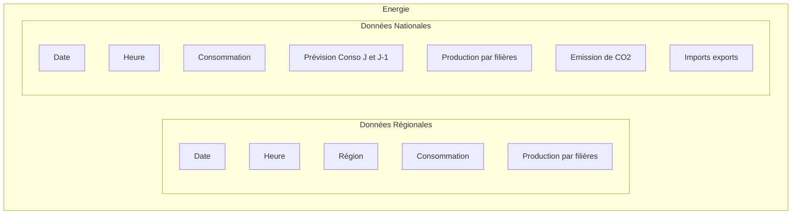
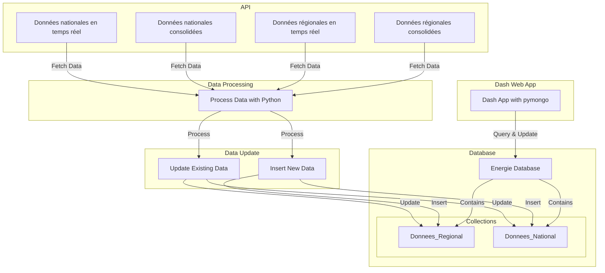

# Visualisations interactives de grande quantité de données énergétiques avec Dash et MongoDB

## Introduction

Dans le cadre du **cours de visualisation analytique**, nous avons réalisé un projet de visualisation de données énergétiques de la France métropolitaine. Nous avons utilisé le framework **Dash** pour réaliser une application web permettant de visualiser de manière interactive les données énergétiques de la France métropolitaine. 

**Repository GitHub :**

{: .light .w-75 .shadow .rounded-10 w='1212' h='668' }

{: .dark .w-75 .shadow .rounded-10 w='1212' h='668' }

## Objectif

L'objectif de ce projet est de réaliser une application web permettant de **visualiser de manière interactive les données énergétiques** de la France métropolitaine.

## Présentation des Données

**éCO2mix** est un outil créé par **RTE France** afin de mieux connaître en temps réel l'électricité en France métropolitaine (hors Corse). RTE France met à disposition gratuitement sur le site **Opendatasoft**, les bases de données utilisées par éCO2mix qui fournissent les données de 2013 à aujourd'hui. Les informations fournies par les bases de données sont les suivantes :

- Consommation d’électricité en France métropolitaine (hors Corse) et prévisions calculées la veille et en début d’après-midi le jour J ;
- Production d’électricité française par filière en valeur et en pourcentage ;
- Échanges commerciaux d’électricité avec les 6 pays voisins ;
- Émissions de CO2 que génère la production d’électricité ;
- Données mensuelles à l’échelle régionale : consommation, production et flux interrégionaux.

Nous avons utilisé les **données énergétiques** de la France métropolitaine fournies par le site **OpenDataSoft**. Ces données sont disponibles en temps réel et consolidées. Nous avons utilisé les données en temps réel ainsi que les données consolidées pour réaliser notre application.

 Liste des API que nous avons utilisé pour récupérer nos données: 

- [Données nationales en temps réel](https://odre.opendatasoft.com/api/explore/v2.1/catalog/datasets/eco2mix-national-tr)
- [Données nationales consolidées](https://odre.opendatasoft.com/api/explore/v2.1/catalog/datasets/eco2mix-national-cons-def)
- [Données régionales en temps réel](https://odre.opendatasoft.com/api/explore/v2.1/catalog/datasets/eco2mix-regional-tr)
- [Données régionales consolidées](https://odre.opendatasoft.com/api/explore/v2.1/catalog/datasets/eco2mix-regional-cons-def)

## Base de données

### Base de données MongoDB

Nous avons utilisé une base de données **MongoDB** pour stocker les données énergétiques de la France métropolitaine. Nous avons créé une base de données nommée "eco2mix" contenant **2 collections** : "national" et "regional". La collection "national" contient les données nationales en temps réel et consolidées, tandis que la collection "regional" contient les données régionales en temps réel et consolidées. Nous avons utilisé la librairie **pymongo** pour interagir avec la base de données MongoDB.

Voici un **schema de la base de données** :

```mermaid
graph TB
    subgraph Energie
        subgraph "Données Régionales"
            A1[Date]
            A2[Heure]
            A3[Région]
            A4[Consommation]
            A5[Production par filières]
        end
        
        subgraph "Données Nationales"
            B1[Date]
            B2[Heure]
            B3[Consommation]
            B4[Prévision Conso J et J-1]
            B5[Production par filières]
            B6[Emission de CO2]
            B7[Imports exports]
        end
    end
```

### Avantages de MongoDB pour Stocker les Données Énergétiques

Nous avons choisi **MongoDB** pour stocker les données énergétiques de notre projet en raison de ses nombreux avantages, particulièrement adaptés aux exigences d'une application de visualisation de données en temps réel.

 Avantages de MongoDB 

**1. Flexibilité des schémas :**
MongoDB permet de gérer des données semi-structurées, ce qui est idéal pour intégrer facilement différentes sources de données énergétiques (nationales et régionales) tout en permettant des ajustements au fil du temps sans restructurer la base de données.

**2. Performance en Temps Réel :**
MongoDB est optimisé pour les lectures et écritures rapides, ce qui est crucial pour notre application où les données énergétiques sont mises à jour en temps réel et doivent être immédiatement disponibles pour les visualisations.

**3. Scalabilité Horizontale :**
Grâce à sa capacité de sharding, MongoDB permet de distribuer les données sur plusieurs serveurs, assurant ainsi une scalabilité efficace pour gérer l'augmentation des données énergétiques au fil du temps.

**4. Facilité d'Intégration avec Python :**
L'intégration native de MongoDB avec **Python**, via la bibliothèque **pymongo**, simplifie l'accès et la manipulation des données, rendant le développement plus fluide et l'interaction avec les données plus intuitive.

**5. Support des Documents JSON :**
MongoDB stocke les données en **BSON** (Binary JSON), facilitant leur utilisation avec les applications web modernes et les frameworks tels que **Dash**, qui s'appuient sur le format JSON pour la transmission des données.

Ces caractéristiques font de MongoDB une solution idéale pour notre projet, offrant une combinaison de flexibilité, performance, et sécurité, adaptée aux besoins d'une application de visualisation interactive en temps réel.

## Framework Dash

### Qu'est-ce que Dash ?

**Dash** est un framework open source développé par **Plotly** qui permet de créer des applications web interactives en **Python**. Dash est basé sur **Flask**, **Plotly.js** et **React.js**, ce qui en fait un framework très puissant pour la création d'applications web interactives. Dash permet de créer des tableaux de bord interactifs, des graphiques, des cartes, des diagrammes, des tableaux, etc., le tout en utilisant uniquement du code Python.

 Pourquoi avons-nous choisi Dash ? 

Nous avons choisi **Dash** pour réaliser notre application web de visualisation de données énergétiques pour plusieurs raisons :
- **Facilité d'utilisation :** Dash permet de créer des applications web interactives en Python, sans avoir besoin de connaissances en HTML, CSS ou JavaScript.
- **Interactivité :** Dash offre des fonctionnalités avancées pour rendre les graphiques et les tableaux de bord interactifs, ce qui est essentiel pour notre application.
- **Intégration avec Plotly :** Dash est basé sur Plotly, une bibliothèque de visualisation de données en ligne très puissante, ce qui nous permet de créer des graphiques de haute qualité.
- **Flexibilité :** Dash offre une grande flexibilité pour personnaliser l'apparence et le comportement de l'application web, ce qui nous permet de créer une interface utilisateur adaptée à nos besoins.

### Les callbacks de Dash

Les **callbacks** de Dash sont un élément clé de l'interactivité de notre application web. Les callbacks permettent de mettre à jour les graphiques, les tableaux et les autres éléments de l'interface utilisateur en fonction des interactions de l'utilisateur. Par exemple, nous avons créé des **dropdowns** pour permettre à l'utilisateur de sélectionner une région ou une date spécifique, et les graphiques se mettent à jour en temps réel en fonction de la sélection de l'utilisateur.

Voici un exemple de callback en Dash :

´´´python 
import view.figures as figures

from dash import callback, Output, Input
from view.datepicker import default_start_date, default_end_date

@callback(
    Output('graph_consommation_by_region', 'figure'),
    Input("date-range-picker", "value"),
)
def update_line_chart_consommation_by_region(dates):
    if dates is None:
        dates = [default_start_date, default_start_date]
    return figures.build_line_chart_consommation_by_region(
        starting_date=dates[0], ending_date=dates[1])
´´´

Ce code montre un exemple de callback qui met à jour un graphique en fonction de la sélection de l'utilisateur dans un **date-range-picker**.

## Architecture de l'Application

```mermaid
flowchart TD
    subgraph API[API]
        classDef title size:58px, color:#000
        class API title
        API1[Données nationales en temps réel]
        API2[Données nationales consolidées]
        API3[Données régionales en temps réel]
        API4[Données régionales consolidées]
    end
    
    subgraph DataProcessing[Data Processing]
        class DataProcessing title
        P1[Process Data with Python]
    end
    
    subgraph Database[Database]
        class Database title
        DB[Energie Database]
        subgraph Collections
            class Collections title
            DR[Donnees_Regional]
            DN[Donnees_National]
        end
    end

    subgraph DataUpdate[Data Update]
        class DataUpdate title
        U1[Update Existing Data]
        U2[Insert New Data]
    end

    subgraph DashApp[Dash Web App]
        class DashApp title
        DWA[Dash App with pymongo]
    end
    
    API1 --> |Fetch Data| P1
    API2 --> |Fetch Data| P1
    API3 --> |Fetch Data| P1
    API4 --> |Fetch Data| P1
    
    P1 --> |Process| U1
    P1 --> |Process| U2
    
    U1 --> |Update| DR
    U1 --> |Update| DN
    U2 --> |Insert| DR
    U2 --> |Insert| DN
    
    DB --> |Contains| DR
    DB --> |Contains| DN
    
    DWA --> |Query & Update| DB
```

Ce schéma illustre l'**architecture de notre application**. Nous avons utilisé des **API** pour récupérer les données énergétiques de la France métropolitaine. Nous avons ensuite traité ces données avec **Python** pour les stocker dans une base de données **MongoDB**. Nous avons créé une application web **Dash** pour visualiser de manière interactive les données énergétiques stockées dans la base de données MongoDB.

## Application Web

### Structure de l'Application

Notre application web est structurée en plusieurs onglets, chacun affichant des visualisations interactives des données énergétiques de la France métropolitaine.  

#### Page d'Accueil

Le premier onglet est la page d'accueil:

Cette page donne un aperçu des trois autres onglets de l'application, qui sont les suivants :
- **Échanges Commerciaux :** Visualisation des échanges commerciaux d'électricité entre la France et ses pays voisins.
- **Production d'Électricité :** Visualisation de la production d'électricité par filière en France, au niveau national et régional.
- **Consommation d'Électricité :** Visualisation de la consommation d'électricité en France, au niveau national et régional.

#### Échanges Commerciaux

L'onglet des échanges commerciaux affiche des graphique interactif montrant les imports et les exports d'électricité entre la France et ses pays voisins.

#### Production d'Électricité

L'onglet de la production d'électricité affiche des graphiques interactifs montrant la production d'électricité par filière en France, au niveau national et régional.

#### Consommation d'Électricité

L'onglet de la consommation d'électricité affiche des graphiques interactifs montrant la consommation d'électricité en France, au niveau national et régional, ainsi que les prévisions de consommation.

## Conclusion

Notre application web de visualisation de données énergétiques de la France métropolitaine est un outil puissant pour explorer et analyser les données énergétiques en temps réel. Grâce à l'utilisation de Dash, MongoDB et les API d'éCO2mix, nous avons pu créer une application web interactive et intuitive qui permet de visualiser de manière dynamique les données énergétiques de la France.
