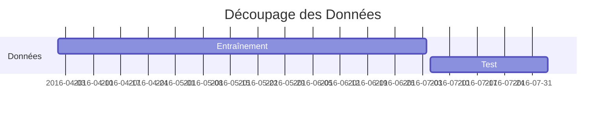

# Recherche sur la Prédiction de Séries Temporelles sur des Réseaux de Capteurs pour les Stations de Vélos à Toulouse

## Introduction

Dans le cadre de notre **projet d’expertise en statistiques et probabilités de Master 1**, nous avons étudié l'apprentissage statistique dans un réseau de capteurs et son application à la reconstruction de la dynamique temporelle des stations de vélos en libre-service à **Toulouse**. Notre étude s'est concentrée sur les données de Toulouse couvrant la période du **1er avril 2016 au 27 septembre 2016**, avec une observation effectuée chaque heure. Pour nos analyses et modèles de prédiction, nous avons utilisé le langage de programmation **Python**, et tous nos résultats sont présentés dans une application interactive **Dash**.

**Repository du projet** :

[](https://github.com/Hisqkq/Time-series-predictions){: .light .w-75 .shadow .rounded-10 w='1212' h='668' }

[](https://github.com/Hisqkq/Time-series-predictions){: .dark .w-75 .shadow .rounded-10 w='1212' h='668' }

<div class="box-warning" markdown="1">
<div class="title"> Application Dash </div>


Dans le cadre de notre projet, nous avons développé une application interactive utilisant **Dash**. L'application est conçue pour permettre une exploration approfondie et intuitive des données des stations de vélo de la ville de Toulouse. Elle est divisée en **deux sections principales** :
1. **Statistiques Descriptives** : Pour analyser la distribution et les tendances des données.
2. **Prédictions** : Pour explorer les différents modèles de prédiction et leurs performances.

**Voici le lien vers notre application Dash** : [**Application Dash**](https://tlavandierter.nw.r.appspot.com/)
*Note : L'application est hébergée sur Google Cloud Platform et peut être consultée en ligne. Cependant, il se peut que l'application soit lente à charger en raison de la taille des données et de la complexité des modèles, ainsi que les limitations de ressources de l'hébergement.*


</div>


## Présentation du Sujet

### Contextualisation

L'objectif principal de notre étude était de modéliser et prédire la **disponibilité des vélos** dans les stations en fonction de différents facteurs temporels et géographiques. Nous avons choisi ce sujet en raison de l'importance croissante des systèmes de vélos en libre-service dans les villes modernes pour promouvoir la **mobilité durable**. La prédiction précise de la disponibilité des vélos est essentielle pour optimiser la gestion des stations et garantir un service de qualité aux utilisateurs.

### Présentation des Données

Les données utilisées pour notre analyse étaient divisées en **trois fichiers CSV** principaux :

| Fichier                      | Description                                                                                               |
|------------------------------|-----------------------------------------------------------------------------------------------------------|
| **coordinates_toulouse.csv** | Contient les noms des stations de Toulouse ainsi que leurs coordonnées géographiques (latitude et longitude). |
| **distance_toulouse.csv**    | Représente une matrice des distances (à vol d’oiseau) entre les différentes stations de vélos.             |
| **X_hour_toulouse.csv**      | Observations horaires de la proportion de vélos disponibles dans les différentes stations. Chaque ligne représente une observation horaire pendant environ six mois. Il y a une observation par heure pour chaque station. |

Ces fichiers nous ont été fournis par notre encadrant de projet, et ont été utilisés dans la suite de notre étude pour l'analyse et la prédiction des données.


## Analyse Statistique des Données

### Distribution des Stations de Vélos

Nous avons commencé par une **analyse descriptive** des données pour comprendre la distribution et la variabilité des vélos disponibles. Cette étape initiale est cruciale pour détecter des tendances générales et des anomalies potentielles. Les outils visuels utilisés comprenaient des **boîtes à moustaches** et des **histogrammes**, qui ont révélé que les stations situées dans le centre-ville étaient en moyenne plus fréquentées que celles en périphérie.
Dans notre application Dash, il est possible de sélectionner une station pour visualiser les différents graphiques de distribution.

Voici un exemple de graphique de distribution d'une station de vélo :

{: .shadow }

### Analyse des Corrélations

L'analyse des corrélations entre les stations a été réalisée en utilisant le **coefficient de corrélation de Pearson**. Cette analyse avait pour objectif de déterminer les relations linéaires entre les disponibilités des différentes stations. Nous avons constaté que les stations proches géographiquement avaient souvent des corrélations positives, ce qui indique des comportements similaires en termes de disponibilité des vélos.

Voici un exemple avec notre **matrice des corrélations interactive** :

{: .shadow }

Il est possible de sélectionner plusieurs stations pour visualiser les corrélations entre elles.   

Il y a également une **map interactive** pour visualiser les corrélations d'une station avec les autres stations de vélo de façon géographique. Pour ce faire, il suffit de cliquer sur une station pour voir les corrélations avec les autres stations.

{: .shadow }

<details class="details-block" markdown="1">
<summary>Théorie derrière l'ACP</summary>

L'**Analyse en Composantes Principales (ACP)** est une technique statistique utilisée pour réduire la dimensionnalité d'un jeu de données tout en conservant le maximum d'information possible. Elle transforme les variables originales en un nouveau jeu de variables, appelées composantes principales, qui sont des combinaisons linéaires des variables originales.

<div class="box-tip" markdown="1">
<div class="title"> Les étapes des l'ACP </div>

1. **Standardisation des données** : Pour éviter que des variables à grande échelle dominent les autres, les données sont standardisées (centrées et réduites) :
   $$
   z_{ij} = \frac{x_{ij} - \bar{x}_j}{s_j}
   $$
   où $ x_{ij} $ est la valeur de la $ i $-ème observation pour la $ j $-ème variable, $ \bar{x}_j $ est la moyenne de la $ j $-ème variable, et $ s_j $ est l'écart-type de la $ j $-ème variable.

2. **Calcul de la matrice de covariance** : La matrice de covariance $ \mathbf{C} $ est calculée à partir des données standardisées :
   $$
   \mathbf{C} = \frac{1}{n-1} \mathbf{Z}^T \mathbf{Z}
   $$
   où $ \mathbf{Z} $ est la matrice des données standardisées.

3. **Calcul des valeurs propres et des vecteurs propres** : Les valeurs propres $ \lambda $ et les vecteurs propres $ \mathbf{v} $ de la matrice de covariance $ \mathbf{C} $ sont calculés pour obtenir les composantes principales :
   $$
   \mathbf{C} \mathbf{v} = \lambda \mathbf{v}
   $$

4. **Sélection des composantes principales** : Les vecteurs propres associés aux plus grandes valeurs propres sont sélectionnés comme composantes principales. Les valeurs propres représentent la quantité de variance expliquée par chaque composante principale.

5. **Projection des données** : Les données standardisées sont projetées sur les composantes principales pour obtenir les nouvelles coordonnées :
   $$
   \mathbf{Y} = \mathbf{Z} \mathbf{V}
   $$
   où $ \mathbf{Y} $ est la matrice des données projetées et $ \mathbf{V} $ est la matrice des vecteurs propres.

</div>

<div class="box-tip" markdown="1">

L'ACP permet de réduire la dimensionnalité des données en conservant les composantes principales qui expliquent la majeure partie de la variance totale. Cette technique est largement utilisée en analyse de données, apprentissage automatique et visualisation de données.

</div>

</details>

Nous avons utilisé l'**Analyse en Composantes Principales (ACP)** pour réduire la dimensionnalité des données tout en conservant l'essentiel de l'information. L'ACP a permis d'identifier les principaux facteurs influençant la variabilité des données et de reconstruire les courbes horaires des stations, capturant ainsi les variations journalières essentielles. Les résultats de l'ACP ont montré que les deux premières composantes expliquaient plus de 90% de la variance des données.

## Prédiction des Activités des Stations de Vélo

### Objectifs de Prédiction

Nos prédictions se sont concentrées sur deux horizons principaux :
- **Prédiction à court terme** : Estimer l’activité des stations pour le jour suivant, utile pour gérer les fluctuations quotidiennes de la demande.
- **Prédiction à moyen terme** : Prévoir l’activité hebdomadaire des stations, essentielle pour la planification stratégique et la redistribution optimale des ressources.

### Méthode d’Entraînement des Modèles

Pour entraîner nos modèles, nous avons utilisé 70% des données disponibles, couvrant la période du 1er avril 2016 au 4 août 2016. Nous avons extrait des **caractéristiques temporelles** des dates pour créer des variables additionnelles comme l'heure, le jour de la semaine, et les indicateurs de week-end et de dimanche. Cette méthode permet de capturer des motifs saisonniers et des cycles récurrents, améliorant ainsi la précision des prédictions.



### Métriques d’Évaluation

Nous avons évalué les performances des modèles en utilisant deux **métriques principales** :
- **Erreur Moyenne Absolue (MAE)** : Mesure la différence moyenne absolue entre les valeurs prédites et réelles.
- **Erreur Quadratique Moyenne (MSE)** : Pénalise plus sévèrement les grandes erreurs, ce qui est crucial pour la gestion stratégique des stations de vélo.

<details class="details-block" markdown="1">
<summary>Théorie derrière MAE et MSE </summary>

<div class="box-tip" markdown="1">
<div class="title"> MAE </div>

L'**Erreur Moyenne Absolue (MAE)** est une métrique d'évaluation qui mesure la différence moyenne absolue entre les valeurs réelles et les valeurs prédites. Elle est calculée en prenant la moyenne des valeurs absolues des erreurs individuelles. La formule pour le MAE est :

$$
MAE = \frac{1}{n} \sum_{i=1}^{n} |y_i - \hat{y}_i|
$$

où $y_i$ est la valeur réelle, $\hat{y}_i$ est la valeur prédite, et $n$ est le nombre total d'observations.
</div>

<div class="box-tip" markdown="1">
<div class="title"> MSE </div>

L'**Erreur Quadratique Moyenne (MSE)** est une métrique d'évaluation qui mesure la moyenne des carrés des erreurs. Elle pénalise plus sévèrement les grandes erreurs en élevant les différences au carré. La formule pour le MSE est :

$$
MSE = \frac{1}{n} \sum_{i=1}^{n} (y_i - \hat{y}_i)^2
$$

où $y_i$ est la valeur réelle, $\hat{y}_i$ est la valeur prédite, et $n$ est le nombre total d'observations.
</div>

</details>


## Description des Modèles de Prédiction

<div class="box-tip" markdown="1">
<div class="title">Modèle Moyenne par Jours et par Heures</div>

- **Description** : 
  - Prédiction basée sur les moyennes horaires des données historiques.
  
- **Avantages** : 
  - Simplicité et rapidité de mise en œuvre.
  
- **Inconvénients** : 
  - Ne capture pas les variations fines et peut manquer de précision pour des prédictions à court terme.

</div>

<div class="box-info" markdown="1">
<div class="title">Modèle via ACP</div>

- **Description** : 
  - Utilisation des composantes principales pour prédire les disponibilités des vélos.
  
- **Avantages** : 
  - Réduction de la dimensionnalité, meilleure capture des tendances principales.
  
- **Inconvénients** : 
  - Complexité accrue dans l’interprétation des résultats.

</div>

<div class="box-warning" markdown="1">
<div class="title">Modèle via Régression Linéaire Multiple</div>

- **Description** : 
  - Prédiction utilisant plusieurs variables explicatives.
  
- **Avantages** : 
  - Facilité d’interprétation et mise en œuvre.
  
- **Inconvénients** : 
  - Sensible aux valeurs aberrantes.
  - Nécessitant un prétraitement des données.

</div>


<div class="box-tip" markdown="1">
<div class="title">Modèle via Forêts Aléatoires</div>

- **Description** : 
  - Utilisation d'arbres décisionnels pour la prédiction.
  
- **Avantages** : 
  - Capacité à gérer de grandes quantités de données et à capturer des interactions complexes entre les variables.
  
- **Inconvénients** : 
  - Temps de calcul élevé et complexité de l'interprétation.

</div>

<div class="box-info" markdown="1">
<div class="title">Modèle XGBoost</div>

- **Description** : 
  - Algorithme de boosting pour améliorer la précision des prédictions.
  
- **Avantages** : 
  - Haute performance, gestion efficace des valeurs manquantes et des interactions complexes.
  
- **Inconvénients** : 
  - Complexité de l’implémentation et du réglage des hyperparamètres.

</div>


<div class="box-warning" markdown="1">
<div class="title">Modèle XGBoost avec ACP</div>

- **Description** : 
  - Intégration de l'ACP avec XGBoost pour une meilleure performance.
  
- **Avantages** : 
  - Précision accrue grâce à la réduction de la dimensionnalité.
  
- **Inconvénients** : 
  - Augmentation de la complexité globale du modèle.

</div>


## Implémentation des Modèles en Python

Nous avons implémenté notre modèle de base pour les prédictions de séries temporelles en utilisant **Python** et la bibliothèque **scikit-learn**. Les modèle de prédictions héréditent de la classe abstraite `ForecastModel` qui définit les méthodes et les attributs communs à tous les modèles. Chaque modèle de prédiction implémente les méthodes `train` et `predict` spécifiques à son algorithme.

<details class="details-block" markdown="1">
<summary> Code python de la classe ForecastModel </summary>

```python
import pandas as pd
import joblib
from sklearn.metrics import mean_squared_error, mean_absolute_error
from typing import Self, Any
from data.city.load_cities import City
from data.data import get_interpolated_indices
from abc import ABC, abstractmethod

PATH_MODEL: str = './data/prediction/methods/'

class ForecastModel(ABC):
    name = 'BaseModel'
    
    def __init__(self: Self, city: City, train_size: float=0.7) -> None:
        self.city = city
        self.train_size = train_size

        self.df_dataset = city.df_hours.copy()
        self.df_dataset = self.df_dataset.set_index('date')
        
        self.split_data()

    def split_data(self: Self) -> None:
        split_point = int(len(self.city.df_hours) * self.train_size)
        self.train_dataset = self.df_dataset.iloc[:split_point]
        self.test_dataset = self.df_dataset.iloc[split_point:]
    
    def save_model(self: Self, model: Any, station_name: str, compress: int=3) -> None:
        joblib.dump(model, f'{PATH_MODEL}{self.name}/{station_name}.pkl', compress=compress)

    def load_model(self: Self, station_name: str) -> Any:
        return joblib.load(f'{PATH_MODEL}{self.name}/{station_name}.pkl')

    @abstractmethod
    def train(self: Self) -> None:
        pass

    @abstractmethod
    def predict(self: Self, selected_station: str, data: pd.Series, forecast_length: int) -> pd.Series: # DOIT RETOURNER UNE SERIE !
        pass
    
    @staticmethod
    def create_features_from_date(date_serie: pd.Series) -> pd.DataFrame:
        df_X = pd.DataFrame()
        df_X['hour'] = date_serie.dt.hour.astype('uint8')
        df_X['day_of_week'] = date_serie.dt.dayofweek.astype('uint8')
        df_X['day_of_month'] = date_serie.dt.day.astype('uint8')
        df_X['is_weekend'] = (date_serie.dt.dayofweek >= 5).astype('uint8')
        df_X['is_sunday'] = (date_serie.dt.dayofweek == 6).astype('uint8')
        return df_X

    @staticmethod
    def get_DatetimeIndex_forecasting(serie: pd.Series, prediction_length: int) -> pd.DatetimeIndex:
        return pd.date_range(serie.index[-1], periods=prediction_length, freq='1h', inclusive='left')
    
    @staticmethod
    def get_metrics(predicted: pd.Series, reality: pd.Series, metrics: str='all', exclude_interpolation_weights: bool=True) -> dict[str, float]:
        sample_weight = pd.Series(1, reality.index)
        if exclude_interpolation_weights:
            sample_weight[get_interpolated_indices(reality)] = 0

        metrics_dict: dict[str, float] = {}
        if metrics == 'all' or metrics == 'mse':
            metrics_dict['mse'] = mean_squared_error(reality, predicted, sample_weight=sample_weight)
        if metrics == 'all' or metrics == 'mae':
            metrics_dict['mae'] = mean_absolute_error(reality, predicted, sample_weight=sample_weight)
        return metrics_dict
```

Voici le modèle de base que nous avons utilisé pour implémenter nos différents modèles de prédiction. Il s'agit d'une classe abstraite `ForecastModel` qui définit les méthodes et les attributs communs à tous les modèles. 

</details>

<details class="details-block" markdown="1">
<summary> Code python du modèle XGBoost </summary>

```python
import pandas as pd
from xgboost import XGBRegressor
from os import makedirs
from typing import Self

from data.city.load_cities import City
from data.data import get_interpolated_indices
from data.prediction.forecast_model import ForecastModel, PATH_MODEL

class XGBoost(ForecastModel):
    name = 'XGBoost'

    def __init__(self: Self, city: City, train_size: float = 0.7) -> None:
        super().__init__(city, train_size)
        makedirs(f'{PATH_MODEL}{self.name}', exist_ok=True)
        self.models = {}

    def train(self: Self) -> None:
        df = self.train_dataset.copy()

        for station in df.columns:
            try:
                current_model = self.load_model(station)
            except FileNotFoundError:
                # Exclure les indices interpolés pour la station
                interpolated_indices = get_interpolated_indices(df[station], output_type='mask')
                df_filtered = df.drop(index=interpolated_indices)

                df_X = ForecastModel.create_features_from_date(df_filtered.index.to_series())
                df_y = df_filtered[station]

                current_model = XGBRegressor(n_estimators=70, max_depth=9, learning_rate=0.08)
                current_model.fit(df_X, df_y)

                self.save_model(current_model, station)
            
            self.models[station] = current_model

    def predict(self: Self, selected_station: str, data: pd.Series, forecast_length: int) -> pd.Series:
        if selected_station not in self.models:
            raise ValueError(f'Model for station {selected_station} not found.')

        data_index = ForecastModel.get_DatetimeIndex_forecasting(data, forecast_length)
        df_X_future = ForecastModel.create_features_from_date(data_index.to_series())

        model = self.models[selected_station]
        predictions = model.predict(df_X_future)
        predictions = predictions.clip(0, 1)
        
        return pd.Series(predictions, index=data_index, name=self.name)
```

Voici l'implementation du modèle XGBoost qui hérite de la classe `ForecastModel`. Ce modèle utilise l'algorithme de boosting XGBoost pour améliorer la précision des prédictions. Il est entraîné sur les données historiques et utilisé pour prédire la disponibilité des vélos.

</details>


Grâce à cette structure, nous avons pu implémenter facilement différents modèles de prédiction en utilisant des algorithmes variés, tout en conservant une cohérence dans l'interface et les méthodes de chaque modèle.  

## Résultats et Visualisations

Il est possible de visualiser les résultats de nos prédictions dans notre application Dash. Voici un exemple de graphique de prédiction sur une semaine pour une station de vélo :

{: .shadow }

Le graphique montre les **valeurs réelles** et **prédites** de la disponibilité des vélos pour une station donnée sur une période d'une semaine. Les prédictions sont basées sur les modèles de prédiction que nous avons entraînés et évalués. Le graphique est interactif, permettant de **zoomer**, de **déplacer** et de visualiser les détails des prédictions. Il est également possible de changer la date de début de la prédiction pour explorer différentes périodes.

## Comparaison des Modèles

### Performances Globales

Les performances des modèles ont été comparées en termes de **MAE** et **MSE** pour identifier les plus performants. Les résultats ont montré que certains modèles étaient plus adaptés pour des prédictions à court terme, tandis que d'autres étaient meilleurs pour des prédictions à moyen terme.

### Analyse Géographique des Métriques

Nous avons également évalué les performances des modèles sur une base géographique, permettant de visualiser les variations locales et d'identifier les zones où les prédictions étaient les plus précises.

{: .shadow }

Cette **carte interactive** montre les performances des différents modèles de prédiction pour chaque station de vélo. Les couleurs indiquent les valeurs de **MAE** et **MSE** (il est possible de sélectionner la métrique que l'on souhaite visualiser), permettant de comparer les performances des modèles sur l'ensemble du réseau de stations.

## Conclusion et Observations

### Analyse Statistique des Données

La première partie du projet a permis de comprendre la structure et les tendances des données, fournissant une base solide pour les modèles de prédiction. L'analyse des corrélations et l'ACP ont révélé des relations intéressantes entre les stations et ont permis de capturer les variations temporelles essentielles. Ces analyses ont fourni des informations précieuses pour la modélisation des activités des stations de vélo. 

### Prédictions et Comparaison des Modèles

La deuxième partie a démontré que certains modèles offrent de meilleures performances selon l'horizon de prédiction choisi. Les prédictions à court terme bénéficient de modèles rapides et flexibles, tandis que les prédictions à moyen terme nécessitent des modèles capables de capturer des tendances plus larges. L'analyse géographique des performances a montré des variations significatives dans les prédictions, soulignant l'importance de modèles adaptés à chaque station.

### Réflexions et Perspectives d’Amélioration

Les résultats de notre étude suggèrent plusieurs pistes d'amélioration, notamment l'intégration de nouvelles sources de données, comme les **données météorologiques** ou **d'événements locaux**, pour affiner les modèles de prédiction et augmenter leur précision. Nous avions également envisagé d'explorer des méthodes plus avancées pour les prévisions de séries temporelles, telles que le **lagging featuring** ou la méthode de **fenêtre glissante**.

