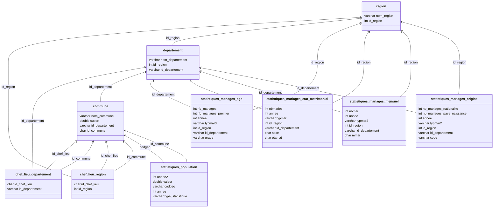

# Mermaid test

```mermaid
classDiagram
direction BT
class chef_lieu_departement {
   char id_chef_lieu
   varchar id_departement
}
class chef_lieu_region {
   char id_chef_lieu
   int id_region
}
class commune {
   varchar nom_commune
   double superf
   varchar id_departement
   char id_commune
}
class departement {
   varchar nom_departement
   int id_region
   varchar id_departement
}
class region {
   varchar nom_region
   int id_region
}
class statistiques_mariages_age {
   int nb_mariages
   int nb_mariages_premier
   int annee
   varchar typmar3
   int id_region
   varchar id_departement
   varchar grage
}
class statistiques_mariages_etat_matrimonial {
   int nbmaries
   int annee
   varchar typmar
   int id_region
   varchar id_departement
   char sexe
   char etamat
}
class statistiques_mariages_mensuel {
   int nbmar
   int annee
   varchar typmar2
   int id_region
   varchar id_departement
   char mmar
}
class statistiques_mariages_origine {
   int nb_mariages_nationalite
   int nb_mariages_pays_naissance
   int annee
   varchar typmar2
   int id_region
   varchar id_departement
   varchar code
}
class statistiques_population {
   int annee2
   double valeur
   varchar codgeo
   int annee
   varchar type_statistique
}

chef_lieu_departement  -->  commune : id_chef_lieu
chef_lieu_departement  -->  commune : id_commune
chef_lieu_departement  -->  departement : id_departement
chef_lieu_region  -->  commune : id_chef_lieu
chef_lieu_region  -->  commune : id_commune
chef_lieu_region  -->  region : id_region
commune  -->  departement : id_departement
departement  -->  region : id_region
statistiques_mariages_age  -->  departement : id_departement
statistiques_mariages_age  -->  region : id_region
statistiques_mariages_etat_matrimonial  -->  departement : id_departement
statistiques_mariages_etat_matrimonial  -->  region : id_region
statistiques_mariages_mensuel  -->  departement : id_departement
statistiques_mariages_mensuel  -->  region : id_region
statistiques_mariages_origine  -->  departement : id_departement
statistiques_mariages_origine  -->  region : id_region
statistiques_population  -->  commune : codgeo
statistiques_population  -->  commune : id_commune
```