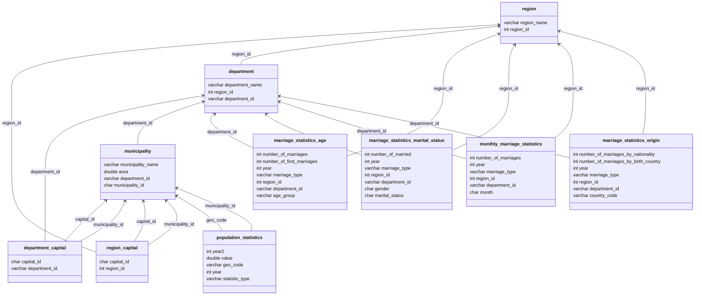

# Modeling and Implementation of an INSEE Database in PostgreSQL

## Introduction

As part of the **Advanced Databases** course, together with my partner [Hamad Tria](https://github.com/HamadTria), we completed a project on modeling and implementing an INSEE database in `PostgreSQL`. We used INSEE data to model a relational database in `PostgreSQL`. We utilized Python to extract data from **INSEE** and insert it into the `PostgreSQL` database, using the `psycopg2` library.

**Project Repository**:

[](https://github.com/Hisqkq/INSEE-Database){: .light .w-75 .shadow .rounded-10 w='1212' h='668' }

[](https://github.com/Hisqkq/INSEE-Database){: .dark .w-75 .shadow .rounded-10 w='1212' h='668' }

## INSEE Data and Modeling Challenges

<div class="box-info" markdown="1">

<div class="title"> We used several csv files from INSEE to extract the following data: </div>

- Data on the municipalities, departments, and regions of mainland France
- Birth, death, population census, housing, and household data over multiple years
- Marriage data for a specific year (2021), with details such as age, marital status, origin, month of marriage, etc.

</div>

INSEE data is structured into multiple csv files with data spanning several years. This structure presents challenges for relational databases.

Indeed, INSEE data is spread across multiple csv files, each representing data for different years. Each year is represented by a column in the csv file, making it difficult to insert data into a relational database. Therefore, it was crucial to model a relational database that could store INSEE data efficiently without needing to alter the database structure every time new yearly data is added.

Thus, we modeled a relational database in PostgreSQL that allows INSEE data to be stored efficiently, without having to modify the database structure with each new year of data.

*Here is a schema of the database*:





## Connecting to the PostgreSQL Database with Python

To connect to the PostgreSQL database with Python, we used the `psycopg2` library. Here’s an example of Python code that allows connecting to the PostgreSQL database:

```python
def connect():
    config = configparser.ConfigParser()
    config.read('config.ini')
    db_params = config['postgresql']
    try:
        conn = psycopg2.connect(**db_params)
        return conn
    except Exception as e:
        exit("Connexion impossible à la base de données: " + str(e))
```

In this code, we use the `configparser` library to read the PostgreSQL database connection parameters from a `config.ini` file. We then use the `connect` method from `psycopg2` to connect to the PostgreSQL database. If the database connection fails, the program displays an error message and stops.

Here’s an example of the `config.ini` configuration file:

```ini
[postgresql]
host=localhost
dbname=database_name
user=username
password=3za2*HuuZD678%dDZx
```
{: file='config.ini'}


In this configuration file, we specify the PostgreSQL database connection parameters, such as the host, database name, user, and password. These parameters are read by the Python script to connect to the PostgreSQL database.

> Warning: It is **important** not to store **plain text passwords** in configuration files. It is recommended to use *encryption methods* to securely store passwords; here, we used a plain text password as an example.
{: .prompt-danger }

## Data Extraction and Insertion

For data extraction and insertion, we used **Python** and the **pandas** and **psycopg2** libraries. We created a Python script that extracts data from INSEE *csv* files and inserts it into the PostgreSQL database.

For each data type, we created a Python function to extract data from the *csv* file and insert it into the PostgreSQL database for a given range of years. This automates the data insertion into the PostgreSQL database without needing to modify the Python script for each new year of data.

For each table, we create a pandas dataframe whose structure matches that of the table in the PostgreSQL database. We then insert the dataframe’s data into the PostgreSQL database using the `psycopg2` library. We used PostgreSQL’s `COPY` method to insert data efficiently, without inserting each row individually.

Here’s the Python function that inserts a dataframe into a table in the PostgreSQL database:


```python
def insert_dataframe_into_table(df, table_name, columns): 
    conn = connect()
    cur = conn.cursor()
    buffer = io.StringIO()
    df.to_csv(buffer, index=False, header=False)
    buffer.seek(0)
    copy_query = f"COPY {table_name} ({', '.join(columns)}) FROM STDIN WITH (FORMAT CSV);"
    cur.copy_expert(copy_query, buffer)
    conn.commit()
    print(f"Données insérées dans la table '{table_name}' avec succès")
    cur.close()
    conn.close()
```

In this function, we use the pandas `to_csv` method to write the dataframe data to a **buffer**. We then use the `copy_expert` method from psycopg2 to insert the data from the **buffer** into the PostgreSQL database table. We specify the table name and columns in the **COPY** query, which allows efficient data insertion into the table.

Once the data is inserted into the PostgreSQL database, we can execute SQL queries to analyze the data and generate reports from the INSEE data.

## Example SQL Query

For example, we can calculate the population density (number of inhabitants per km²) in 2020 by region:

```sql
SELECT 
    r.region_id, 
    r.region_name, 
    COALESCE(SUM(sp.value), 0) AS total_population,
    COALESCE(SUM(c.area), 0) AS total_area,
    CASE 
        WHEN SUM(c.area) > 0 THEN ROUND((SUM(sp.value) / SUM(c.area))::numeric, 2)
        ELSE 0.00 
    END AS inhabitants_per_km2
FROM 
    region r
JOIN 
    department d ON r.region_id = d.region_id
JOIN 
    municipality c ON d.department_id = c.department_id
JOIN 
    population_statistics sp ON c.municipality_id = sp.geo_code AND sp.statistic_type = 'Population' AND sp.year = 2020
GROUP BY 
    r.region_id, r.region_name
ORDER BY 
    inhabitants_per_km2 DESC;

```

<details class="details-block" markdown="1">
<summary>Result of the SQL Query</summary>


| region_id | region_name                     | total_population | total_area | inhabitants_per_km2 |
|-----------|--------------------------------|-------------------|-------------------|-------------------|
| 11        | Île-de-France                  | 12223827          | 11921.42          | 1025.37           |
| 32        | Hauts-de-France                | 5961696           | 31313.93          | 190.38            |
| 93        | Provence-Alpes-Côte d'Azur     | 5093759           | 30905.69          | 164.82            |
| 52        | Pays de la Loire               | 3334814           | 25570.94          | 130.41            |
| 53        | Bretagne                       | 3237294           | 25414.73          | 127.38            |
| 28        | Normandie                      | 2867525           | 23611.02          | 121.45            |
| 84        | Auvergne-Rhône-Alpes           | 7748092           | 65814.38          | 117.73            |
| 44        | Grand Est                      | 5455836           | 56067.50          | 97.31             |
| 76        | Occitanie                      | 5930813           | 69620.11          | 85.19             |
| 75        | Nouvelle-Aquitaine             | 5859440           | 80242.53          | 73.02             |
| 24        | Centre-Val de Loire            | 2517920           | 37940.16          | 66.37             |
| 27        | Bourgogne-Franche-Comté        | 2751104           | 46633.62          | 58.99             |
| 94        | Corse                          | 343701            | 8679.79           | 39.60             |

</details>

This SQL query calculates the population density (number of inhabitants per km²) in 2020 by region in France. We can observe that Île-de-France is the most densely populated region, with a population density of 1025.37 inhabitants per km², while Corsica is the least densely populated region, with a density of 39.60 inhabitants per km².

## Stored Procedure

To automate the calculation of population by department and region, we created a stored procedure in PostgreSQL that calculates the total population by department and region, based on the given year.


```sql
ALTER TABLE department ADD COLUMN total_population INT;
ALTER TABLE region ADD COLUMN total_population INT;

CREATE OR REPLACE PROCEDURE calculate_population()
LANGUAGE plpgsql
AS $$
BEGIN
    -- Calculate population for departments
    UPDATE department d
    SET total_population = sub.population
    FROM (
        SELECT c.department_id, SUM(sp.value) AS population
        FROM municipality c
        JOIN population_statistics sp ON c.municipality_id = sp.geo_code
        WHERE sp.statistic_type = 'Population' AND sp.year = 2020
        GROUP BY c.department_id
    ) AS sub
    WHERE d.department_id = sub.department_id;

    -- Calculate population for regions
    UPDATE region r
    SET total_population = sub.population
    FROM (
        SELECT d.region_id, SUM(d.total_population) AS population
        FROM department d
        GROUP BY d.region_id
    ) AS sub
    WHERE r.region_id = sub.region_id;
END;
$$;

CALL calculate_population();
```

This stored procedure allows the calculation of the total population by department and region based on the given year. The stored procedure can then be called using **CALL** to compute the total population by department and region for the specified year.

## Triggers

### Triggers to Prevent Modifications on the Municipality, Department, and Region Tables

We created triggers to prevent direct modifications to the municipality, department, and region tables. The triggers ensure that any inserted, updated, or deleted data complies with the database constraints.

Example of a trigger to prevent modifications on the `region` table:


```sql
CREATE OR REPLACE FUNCTION block_region_actions()
    RETURNS trigger AS $$
    BEGIN
        IF TG_OP = 'DELETE' OR TG_OP = 'INSERT' THEN
            RAISE EXCEPTION 'Insertion or deletion not allowed on the region table';
        ELSIF TG_OP = 'UPDATE' THEN
            IF OLD.region_id IS DISTINCT FROM NEW.region_id OR OLD.region_name IS DISTINCT FROM NEW.region_name THEN
                RAISE EXCEPTION 'Modification not allowed on the columns region_id or region_name in the region table';
            END IF;
        END IF;
        RETURN NEW;
    END;
    $$ LANGUAGE plpgsql;

CREATE TRIGGER tr_block_region_actions
BEFORE INSERT OR UPDATE OR DELETE ON region
FOR EACH ROW EXECUTE FUNCTION block_region_actions();
```

This trigger prevents insertions, updates, and deletions on the `region` table. It checks whether the inserted, updated, or deleted data complies with the database constraints. If the data does not meet the constraints, the trigger raises an exception and prevents the action from being executed.

### Trigger to Update the Total Population of Regions and Departments

We also created a trigger to automatically update the total population of regions and departments whenever a municipality is inserted, updated, or deleted.


```sql
CREATE OR REPLACE FUNCTION update_population()
    RETURNS trigger AS $$
    BEGIN
        CALL calculate_population();
        RETURN NEW;
    END;
    $$ LANGUAGE plpgsql;

CREATE TRIGGER tr_update_population
AFTER INSERT OR UPDATE ON population_statistics
FOR EACH ROW EXECUTE FUNCTION update_population();

```

This trigger calls the stored procedure `calculate_population` to automatically update the total population of regions and departments whenever a municipality is inserted, updated, or deleted. This ensures that the database data remains up-to-date and maintains data consistency.

## Indexes and Execution Plan

For the analysis of indexes and execution plans, we used PostgreSQL’s `EXPLAIN ANALYZE` tool to examine the performance of SQL queries. We evaluated the impact of indexes on performance using a SQL query to find which region had the largest population in 2020, based on the `population_statistics` table.

### Index on the `value` Column of the `population_statistics` Table

To improve the performance of SQL queries, we created indexes on the columns most frequently used in queries. Indexes speed up database searches by creating additional data structures that allow for quick retrieval of the desired data.


```sql
CREATE INDEX pop_idx ON population_statistics (value) WHERE statistic_type = 'Population';

EXPLAIN ANALYZE 
SELECT r.region_id, r.region_name, SUM(sp.value) AS total_population
FROM region r
JOIN department d ON r.region_id = d.region_id
JOIN municipality c ON d.department_id = c.department_id
JOIN population_statistics sp ON c.municipality_id = sp.geo_code
WHERE sp.year = 2020 AND sp.statistic_type = 'Population'
GROUP BY r.region_id, r.region_name
ORDER BY total_population DESC
LIMIT 1;
```

<details class="details-block" markdown="1">
<summary> Result of the EXPLAIN Query </summary>


```text
Limit  (cost=28771.37..28771.37 rows=1 width=82) (actual time=272.268..279.262 rows=1 loops=1)
  ->  Sort  (cost=28771.37..28773.29 rows=770 width=82) (actual time=272.267..279.259 rows=1 loops=1)
        Sort Key: (sum(sp.valeur)) DESC
        Sort Method: top-N heapsort  Memory: 25kB
        ->  Finalize GroupAggregate  (cost=28572.44..28767.52 rows=770 width=82) (actual time=272.231..279.247 rows=13 loops=1)
              Group Key: r.id_region
              ->  Gather Merge  (cost=28572.44..28752.12 rows=1540 width=82) (actual time=272.219..279.225 rows=37 loops=1)
                    Workers Planned: 2
                    Workers Launched: 2
                    ->  Sort  (cost=27572.42..27574.34 rows=770 width=82) (actual time=263.371..263.383 rows=12 loops=3)
                          Sort Key: r.id_region
                          Sort Method: quicksort  Memory: 25kB
                          Worker 0:  Sort Method: quicksort  Memory: 25kB
                          Worker 1:  Sort Method: quicksort  Memory: 25kB
                          ->  Partial HashAggregate  (cost=27527.80..27535.50 rows=770 width=82) (actual time=263.308..263.329 rows=12 loops=3)
                                Group Key: r.id_region
                                Batches: 1  Memory Usage: 49kB
                                Worker 0:  Batches: 1  Memory Usage: 49kB
                                Worker 1:  Batches: 1  Memory Usage: 49kB
                                ->  Hash Join  (cost=4920.08..27480.38 rows=9484 width=82) (actual time=90.899..248.393 rows=11415 loops=3)
                                      Hash Cond: (d.id_region = r.id_region)
                                      ->  Hash Join  (cost=4892.75..27428.03 rows=9484 width=12) (actual time=90.765..238.417 rows=11415 loops=3)
                                            Hash Cond: ((c.id_departement)::text = (d.id_departement)::text)
                                            ->  Hash Join  (cost=4886.43..27396.27 rows=9484 width=11) (actual time=90.585..227.100 rows=11415 loops=3)
                                                  Hash Cond: ((sp.codgeo)::bpchar = c.id_commune)
                                                  ->  Parallel Bitmap Heap Scan on statistiques_population sp  (cost=3818.06..26303.00 rows=9484 width=14) (actual time=30.992..141.551 rows=11415 loops=3)
                                                        Recheck Cond: ((type_statistique)::text = 'Population'::text)
                                                        Filter: (annee = 2020)
                                                        Rows Removed by Filter: 68492
                                                        Heap Blocks: exact=1905
                                                        ->  Bitmap Index Scan on pop_idx  (cost=0.00..3812.37 rows=237590 width=0) (actual time=25.049..25.050 rows=239722 loops=1)
                                                  ->  Hash  (cost=632.61..632.61 rows=34861 width=9) (actual time=59.169..59.170 rows=34861 loops=3)
                                                        Buckets: 65536  Batches: 1  Memory Usage: 1908kB
                                                        ->  Seq Scan on commune c  (cost=0.00..632.61 rows=34861 width=9) (actual time=0.076..33.666 rows=34861 loops=3)
                                            ->  Hash  (cost=3.92..3.92 rows=192 width=7) (actual time=0.114..0.115 rows=96 loops=3)
                                                  Buckets: 1024  Batches: 1  Memory Usage: 12kB
                                                  ->  Seq Scan on departement d  (cost=0.00..3.92 rows=192 width=7) (actual time=0.047..0.076 rows=96 loops=3)
                                      ->  Hash  (cost=17.70..17.70 rows=770 width=74) (actual time=0.103..0.104 rows=13 loops=3)
                                            Buckets: 1024  Batches: 1  Memory Usage: 9kB
                                            ->  Seq Scan on region r  (cost=0.00..17.70 rows=770 width=74) (actual time=0.085..0.088 rows=13 loops=3)
Planning Time: 1.259 ms
Execution Time: 280.319 ms
```

</details>

The index on the `value` column of the `population_statistics` table helped speed up the query by reducing the query execution time by about 100 ms. This demonstrates the importance of indexes in improving SQL query performance.

### Composite Index on the `year`, `statistic_type`, and `value` Columns of the `population_statistics` Table

To further improve SQL query performance, we created a composite index on the `year`, `statistic_type`, and `value` columns of the `population_statistics` table. This index speeds up searches in the `population_statistics` table by creating an additional data structure that allows for quick retrieval of the desired data.


```sql
CREATE INDEX idx_population_composite ON population_statistics (year, statistic_type, value) WHERE statistic_type = 'Population';

EXPLAIN ANALYZE 
SELECT r.region_id, r.region_name, SUM(sp.value) AS total_population
FROM region r
JOIN department d ON r.region_id = d.region_id
JOIN municipality c ON d.department_id = c.department_id
JOIN population_statistics sp ON c.municipality_id = sp.geo_code
WHERE sp.year = 2020 AND sp.statistic_type = 'Population'
GROUP BY r.region_id, r.region_name
ORDER BY total_population DESC
LIMIT 1;

```
<details class="details-block" markdown="1">
<summary> Result of the EXPLAIN Query </summary>


```text
Limit  (cost=24300.14..24300.14 rows=1 width=82) (actual time=153.402..153.408 rows=1 loops=1)
  ->  Sort  (cost=24300.14..24302.06 rows=770 width=82) (actual time=153.401..153.405 rows=1 loops=1)
        Sort Key: (sum(sp.valeur)) DESC
        Sort Method: top-N heapsort  Memory: 25kB
        ->  HashAggregate  (cost=24288.59..24296.29 rows=770 width=82) (actual time=153.376..153.388 rows=13 loops=1)
              Group Key: r.id_region
              Batches: 1  Memory Usage: 49kB
              ->  Hash Join  (cost=1734.84..24174.78 rows=22761 width=82) (actual time=30.762..137.295 rows=34246 loops=1)
                    Hash Cond: (d.id_region = r.id_region)
                    ->  Hash Join  (cost=1707.51..24087.37 rows=22761 width=12) (actual time=30.733..104.846 rows=34246 loops=1)
                          Hash Cond: ((c.id_departement)::text = (d.id_departement)::text)
                          ->  Hash Join  (cost=1701.19..24019.98 rows=22761 width=11) (actual time=30.679..86.422 rows=34246 loops=1)
                                Hash Cond: ((sp.codgeo)::bpchar = c.id_commune)
                                ->  Bitmap Heap Scan on statistiques_population sp  (cost=632.82..22891.85 rows=22761 width=14) (actual time=9.557..35.077 rows=34246 loops=1)
                                      Recheck Cond: ((annee = 2020) AND ((type_statistique)::text = 'Population'::text))
                                      Heap Blocks: exact=6408
                                      ->  Bitmap Index Scan on idx_population_composite  (cost=0.00..627.13 rows=22761 width=0) (actual time=8.415..8.415 rows=34246 loops=1)
                                            Index Cond: (annee = 2020)
                                ->  Hash  (cost=632.61..632.61 rows=34861 width=9) (actual time=21.090..21.090 rows=34861 loops=1)
                                      Buckets: 65536  Batches: 1  Memory Usage: 1908kB
                                      ->  Seq Scan on commune c  (cost=0.00..632.61 rows=34861 width=9) (actual time=0.008..7.359 rows=34861 loops=1)
                          ->  Hash  (cost=3.92..3.92 rows=192 width=7) (actual time=0.043..0.043 rows=96 loops=1)
                                Buckets: 1024  Batches: 1  Memory Usage: 12kB
                                ->  Seq Scan on departement d  (cost=0.00..3.92 rows=192 width=7) (actual time=0.005..0.023 rows=96 loops=1)
                    ->  Hash  (cost=17.70..17.70 rows=770 width=74) (actual time=0.018..0.019 rows=13 loops=1)
                          Buckets: 1024  Batches: 1  Memory Usage: 9kB
                          ->  Seq Scan on region r  (cost=0.00..17.70 rows=770 width=74) (actual time=0.010..0.012 rows=13 loops=1)
Planning Time: 2.180 ms
Execution Time: 156.935 ms
```

</details>
The composite index on the `year`, `statistic_type`, and `value` columns of the `population_statistics` table helped speed up the query by reducing execution time by about 120 ms compared to the query using the previous index. This index is therefore optimized for queries that filter on the `year`, `statistic_type`, and `value` columns of the `population_statistics` table, which is the case for the analyzed query.

## Transactions and Isolation

To ensure data consistency and transaction reliability, we used transactions and transaction isolation in PostgreSQL. Transactions allow multiple SQL operations to be grouped into a single logical unit that is executed atomically, meaning either all the operations in the transaction are executed, or none are executed. Transaction isolation controls the visibility of data between concurrent transactions to ensure data consistency.

We will illustrate the use of transactions with the `ISOLATION_LEVEL_READ_COMMITTED` isolation level in PostgreSQL.

By using two Python threads to simulate concurrent transactions, we will insert data into the `population_statistics` table and check data consistency.


```python
def add_population_entry(delay):
    conn = connect()
    conn.set_isolation_level(psycopg2.extensions.ISOLATION_LEVEL_READ_COMMITTED)
    cur = conn.cursor()
    try:
        cur.execute("INSERT INTO population_statistics (geo_code, year, statistic_type, value) VALUES ('33063', 2024, 'TEST', 150000);")
        print("Transaction A: Insertion done, waiting for commit...")
        time.sleep(delay) 
        conn.commit()
        print("Transaction A: Population added and committed.")
    except Exception as e:
        print(f"Transaction A: Error while adding population, {e}")
        conn.rollback()
    finally:
        cur.close()
        conn.close()

def read_population_entry(delay):
    time.sleep(delay)  # Wait for Transaction A to start
    conn = connect()
    conn.set_isolation_level(psycopg2.extensions.ISOLATION_LEVEL_READ_COMMITTED)
    cur = conn.cursor()
    try:
        cur.execute("SELECT value FROM population_statistics WHERE geo_code = '33063' AND year = 2024 AND statistic_type = 'TEST';")
        result = cur.fetchone()
        if result:
            print(f"Transaction B: Population seen by B: {result[0]}")
        else:
            print("Transaction B: No population found.")
    except Exception as e:
        print(f"Transaction B: Error while reading population, {e}")
    finally:
        cur.close()
        conn.close()

# Run the transactions using threads
thread_a = threading.Thread(target=add_population_entry, args=(10,))
thread_b = threading.Thread(target=read_population_entry, args=(5,))

thread_a.start()
thread_b.start()

thread_a.join()
thread_b.join()

```

```text
Transaction A: Insertion done, waiting for commit...
Transaction B: No population found.
Transaction A: Population added and committed.
`
```

In this example, Transaction A inserts a population of 150,000 inhabitants for the municipality `33063` in 2024 and then commits the transaction. Transaction B reads the population of the municipality `33063` in 2024 after a 5-second delay. Since Transaction A hasn't committed yet, Transaction B doesn't see the population inserted by Transaction A. After Transaction A commits, Transaction B is still unable to see the population inserted by Transaction A.

This demonstrates PostgreSQL's transaction isolation, which controls data visibility between concurrent transactions to ensure data consistency.

## Conclusion

In this project, we modeled and implemented an INSEE database in `PostgreSQL` using INSEE data. We used the Python language to extract INSEE data and insert it into the PostgreSQL database, using the `psycopg2` library. We used **stored procedures**, **triggers**, **indexes**, and **transactions** to ensure data consistency and improve SQL query performance. This project allowed us to put into practice our knowledge of **relational databases** and PostgreSQL, while deepening our skills in **database modeling** and **SQL**.

<style>

    #visualization {
    width: 80%;
    height: 400px;
    margin: 0 auto; 
    display: flex;
    align-items: center; 
    justify-content: center;
  }
  </style>

<div id="visualization"></div>

