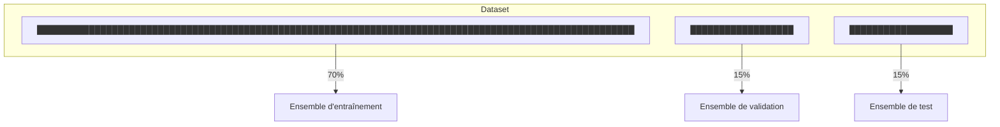

# Military Aircraft Detection in Images and Videos using YOLOv8

## Introduction

In this project, I used a **YOLOv8** model to **detect and classify military aircraft** in images and videos. The goal is to demonstrate the power of Object Detection in the field of **Computer Vision**, particularly for the recognition of complex and moving objects, especially objects with similar characteristics like military aircraft.

> The notebook associated with this project is available at [this Kaggle link](https://www.kaggle.com/code/hisakaa/yolov8-aircraft-detection/).
{: .prompt-info }

## YOLOv8

YOLOv8 is an Object Detection model based on the YOLO (You Only Look Once) neural network. It is the eighth version of this model, which has been improved to be faster and more accurate than its predecessors. Developed by Ultralytics, YOLOv8 offers significant improvements in terms of accuracy and speed compared to its previous versions.

<div class="box-info" markdown="1">
<div class="title">Main Features of YOLOv8</div>

- **Real-time Detection**: Capable of processing live videos to detect objects instantly.
- **High Accuracy**: Uses advanced deep learning techniques to provide precise predictions.
- **Efficiency**: Designed to be used even on machines with limited resources, such as laptops without a powerful GPU.

</div>

<div class="box-tip" markdown="1">
<div class="title">Advantages of YOLOv8</div>

- **Speed**: Optimized for speed, which is crucial for applications like aerial surveillance.
- **Versatility**: Can be applied to various types of objects and contexts, including aircraft detection in images and videos.
- **Ease of Use**: Integrated with popular development tools and well-documented, making it easy to implement.

</div>

By using YOLOv8, this project aims to demonstrate how modern computer vision technologies can be effectively applied for detecting specific objects in images and videos, contributing to fields such as security and aerial surveillance.

## Dataset

We have a rich dataset containing 14,500 images, each containing one or more aircraft. For each image, an associated CSV file provides detailed annotations of the aircraft present, including the coordinates of their positions (xmin, ymin, xmax, ymax) and their classification.

<div class="box-info" markdown="1">

<div class="title"> Example of a CSV File </div>

| filename                         | width | height | class | xmin | ymin | xmax | ymax |
|----------------------------------|-------|--------|-------|------|------|------|------|
| 000aa01b25574f28b654718db0700f72 | 2048  | 1365   | F35   | 852  | 177  | 1998 | 503  |
| 000aa01b25574f28b654718db0700f72 | 2048  | 1365   | JAS39 | 169  | 769  | 549  | 893  |
| 000aa01b25574f28b654718db0700f72 | 2048  | 1365   | JAS39 | 125  | 908  | 440  | 1009 |
| 000aa01b25574f28b654718db0700f72 | 2048  | 1365   | B52   | 277  | 901  | 1288 | 1177 |

This data provides a solid foundation for training and **testing** our YOLOv8 model, enabling it to accurately recognize various types of military aircraft in different contexts.

</div>

### Sample Images from the Dataset

Here are some sample images from the dataset used to train and test the YOLOv8 model, along with their corresponding annotations:


This image shows a **C5 Galaxy** aircraft, a heavy military transport aircraft used by the US Air Force. Military aircraft can have various shapes and sizes, making their detection and classification challenging for Object Detection models.


This image shows a **Mirage 2000** aircraft, a fighter jet designed by the French company Dassault Aviation in the late 1970s. The **Mirage 2000** is primarily used by the French Air Force, which received 315 units, while 286 others were exported to eight different countries.

The dataset contains all types of images—some clearer than others, images with one or multiple aircraft, and others with aircraft from different classes. This allows us to test the model's ability to detect and classify aircraft in **varied contexts**.

## Model Training

To train a **YOLOv8 model**, it is essential to have a labeled dataset that will serve as the basis for the model’s learning. In this project, we used a dataset containing 14,500 images of military aircraft, each annotated with the `coordinates` of the aircraft present and their `classification`.

### Train Validation Test Split

Before starting the training, we split our dataset into three distinct parts: a training set **(70%)**, a validation set **(15%)**, and a test set **(15%)**. This division allows us to check the model's performance on unseen data and ensure it generalizes well to images it has not seen before.





### Training Steps

#### 1. **Model Configuration**  
A YAML configuration file is created to specify:

- The paths to the training, validation, and test sets.
- The number of classes to detect.
- The class names.

<div class="box-info" markdown="1">

<div class="title"> Example Configuration: </div>

```yaml 
train: ../data/train.txt
val: ../data/val.txt
test: ../data/test.txt
nc: 3
names: ['F35', 'JAS39', 'B52']
```

</div>

#### 2. **Model Architecture**  
YOLOv8 uses a convolutional neural network (CNN) architecture with several layers:  

- **Convolutional layers**: To extract features from the images.  
- **Activation layers**: To introduce non-linearity.  
- **Pooling layers**: To reduce dimensionality.  
- **Prediction layers**: To generate predictions for bounding boxes and classes.  

Each layer is designed to capture specific information from the images and combine it to produce accurate predictions.  

#### 3. **Training Process**   
During training, the model goes through the following steps:   

- **Forward propagation**: The image passes through the model's layers, producing predictions.  
- **Loss calculation**: The difference between the predictions and the actual annotations is calculated. YOLO's loss function combines classification errors, localization errors, and missing objects.  
- **Backward propagation**: The loss gradients are calculated and used to update the model's weights through the gradient descent algorithm.  
- **Validation**: After each epoch, the model is evaluated on the validation set to adjust hyperparameters and prevent overfitting.  


## Model Validation

After training, the model is evaluated on the test set to measure its performance. The following metrics are used to assess the quality of the predictions:

- **Box(P)**: Precision of the bounding box detections.
- **R**: Recall, measuring the model's ability to find all relevant instances.
- **mAP50**: Mean Average Precision at 50% IoU (Intersection over Union), measuring the average precision at a 50% IoU threshold.
- **mAP50-95**: Mean Average Precision at different IoU thresholds, from 50% to 95%.

These metrics evaluate the model's ability to detect and classify military aircraft with precision and recall, while minimizing false positives and false negatives.

<div class="box-info" markdown="1">

<div class="title"> Here is an example code to evaluate the model on the test set: </div>

```python
!yolo val \
model='/kaggle/input/yolov7-military-plane/yolov8-m-best.pt' \
data='/kaggle/working/ultralytics/data/mad.yaml'\
augment \
batch=12 \
imgsz=1280
```

</div>

This code is used to evaluate the model on the validation set, using the trained model and the parameters specified in the YAML configuration file.

Here are the results of the model evaluation on the validation set:

<details class="details-block" markdown="1">
<summary> Model Evaluation Results </summary>


| Class        | Images | Instances | Box(P) | R    | mAP50 | m   |
|--------------|--------|-----------|-------|------|-------|-----|
| all          | 2024   | 3408      | 0.944 | 0.86 | 0.938 | 0.89|
| A10          | 48     | 82        | 0.961 | 0.927| 0.953 | 0.902|
| A400M        | 46     | 67        | 0.938 | 0.866| 0.951 | 0.883|
| AG600        | 34     | 35        | 0.994 | 1.0  | 0.995 | 0.981|
| AV8B         | 37     | 65        | 0.963 | 0.985| 0.986 | 0.97 |
| B1           | 49     | 67        | 0.929 | 0.91 | 0.951 | 0.912|
| B2           | 52     | 68        | 0.95  | 0.844| 0.96  | 0.855|
| B52          | 50     | 64        | 0.979 | 0.922| 0.967 | 0.929|
| Be200        | 32     | 35        | 0.981 | 1.0  | 0.995 | 0.928|
| C130         | 93     | 180       | 0.87  | 0.928| 0.945 | 0.885|
| C2           | 107    | 146       | 0.966 | 0.966| 0.991 | 0.973|
| C17          | 59     | 88        | 0.9   | 0.82 | 0.927 | 0.844|
| C5           | 50     | 50        | 0.944 | 0.88 | 0.947 | 0.925|
| E2           | 47     | 67        | 0.938 | 0.905| 0.936 | 0.898|
| E7           | 16     | 18        | 1.0   | 0.976| 0.995 | 0.974|
| EF2000       | 56     | 84        | 0.929 | 0.726| 0.885 | 0.832|
| F117         | 35     | 46        | 1.0   | 0.822| 0.904 | 0.852|
| F14          | 38     | 68        | 0.922 | 0.824| 0.884 | 0.843|
| F15          | 102    | 196       | 0.9   | 0.934| 0.957 | 0.914|
| F16          | 135    | 223       | 0.889 | 0.78 | 0.873 | 0.793|
| F18          | 95     | 207       | 0.945 | 0.865| 0.948 | 0.869|
| F22          | 56     | 90        | 0.905 | 0.842| 0.918 | 0.893|
| F35          | 113    | 147       | 0.913 | 0.862| 0.937 | 0.871|
| F4           | 58     | 86        | 0.944 | 0.849| 0.916 | 0.854|
| JAS39        | 51     | 81        | 0.935 | 0.852| 0.943 | 0.885|
| MQ9          | 34     | 36        | 0.898 | 0.732| 0.899 | 0.852|
| Mig31        | 39     | 65        | 0.947 | 0.825| 0.938 | 0.897|
| Mirage2000   | 30     | 75        | 0.95  | 0.853| 0.87  | 0.841|
| P3           | 34     | 63        | 0.971 | 0.529| 0.799 | 0.756|
| RQ4          | 52     | 65        | 0.918 | 0.864| 0.948 | 0.869|
| Rafale       | 59     | 98        | 0.887 | 0.857| 0.931 | 0.89 |
| SR71         | 25     | 42        | 0.896 | 0.786| 0.955 | 0.887|
| Su34         | 48     | 62        | 0.937 | 0.871| 0.953 | 0.907|
| Su57         | 41     | 72        | 0.971 | 0.929| 0.979 | 0.945|
| Tu160        | 40     | 54        | 0.959 | 0.926| 0.97  | 0.921|
| Tu95         | 26     | 36        | 0.965 | 0.758| 0.91  | 0.877|
| Tornado      | 43     | 63        | 0.961 | 0.774| 0.924 | 0.882|
| U2           | 38     | 44        | 0.976 | 0.934| 0.987 | 0.956|
| US2          | 84     | 90        | 0.981 | 0.944| 0.981 | 0.942|
| V22          | 68     | 100       | 0.988 | 0.847| 0.947 | 0.853|
| XB70         | 20     | 20        | 0.98  | 0.9  | 0.938 | 0.88 |
| YF23         | 13     | 18        | 0.968 | 0.833| 0.953 | 0.941|
| Vulcan       | 46     | 69        | 0.961 | 0.754| 0.911 | 0.851|
| J20          | 47     | 76        | 0.906 | 0.776| 0.896 | 0.856|


Overall, the metrics show that the model has good precision (0.944) and recall (0.86). The mAP50 and mAP50-95 values indicate high performance for most aircraft classes, with scores close to or above 0.9, demonstrating the model's effectiveness in detecting aircraft in images. It is important to note that some classes have lower scores, which could be due to variations in the training data or specific characteristics of the aircraft. These results can be used to improve the model by adjusting the hyperparameters or collecting more data for underrepresented classes.

</details>

## Testing the Model on Images

### Test on Test Dataset

After training and validating the model, we can test it on real images to evaluate its performance under real-world conditions. Here is an example of code to test the model on some images from the test dataset:

```python
from ultralytics import YOLO
import cv2
import matplotlib.pyplot as plt
import glob
import random
import pandas as pd

model = YOLO('/kaggle/input/yolov7-military-plane/yolov8-m-best.pt')

test_image_paths = sorted(glob.glob('/kaggle/working/ultralytics/data/test/images/*.jpg'))
test_annotation_paths = sorted(glob.glob('/kaggle/working/ultralytics/data/test/labels/*.txt'))

sampled_indices = random.sample(range(len(test_image_paths)), 5)
sampled_image_paths = [test_image_paths[i] for i in sampled_indices]
sampled_annotation_paths = [test_annotation_paths[i] for i in sampled_indices]

results = model(sampled_image_paths)

for img_path, ann_path, result in zip(sampled_image_paths, sampled_annotation_paths, results):
    image = cv2.imread(img_path)[:, :, ::-1]
    plt.figure(figsize=(10, 10))
    plt.imshow(image)
    ax = plt.gca()

    with open(ann_path, 'r') as f:
        annotations = f.readlines()
    
    print(f"Real Annotations for {img_path}:")
    for annotation in annotations:
        class_num, x_center, y_center, b_width, b_height = map(float, annotation.split())
        class_name = model.names[int(class_num)]
        print(f"Class: {class_name}")

    for box in result.boxes:
        x1, y1, x2, y2 = box.xyxy[0].cpu().numpy() 
        rect = plt.Rectangle((x1, y1), x2 - x1, y2 - y1, fill=False, color='red')
        ax.add_patch(rect)
        plt.text(x1, y1, model.names[int(box.cls[0])], color='white', fontsize=12, bbox=dict(facecolor='red', alpha=0.5))

    plt.axis('off')
    plt.show()
```

The code loads the **trained YOLOv8 model**, selects a few random images from the test dataset, makes predictions on these images, and displays the results. The ground truth annotations are also printed for comparison with the model's predictions.

### Test on Real Images

In addition to the test dataset images, we can also test the model on **out-of-sample images** to assess its ability to generalize to new data. I selected an image of a Rafale from Google Images to test the model.

Here is the Rafale image used for the test and the model's prediction:


We can see that the model correctly detected and classified the two Rafale aircraft in the image, with accurate bounding boxes and correct class predictions.

## Testing the Model on Videos

In addition to images, the YOLOv8 model can also be used to detect aircraft **in videos**. I tested the model on a promotional video of the Rafale on YouTube. Here is the link to the video: [Rafale Video](https://www.youtube.com/watch?v=OCghuDF5sec)

After downloading the video, I extracted frames at regular intervals and used the YOLOv8 model to detect the aircraft in each frame. Here is an example of code to detect aircraft in a video:


```python
import cv2
import numpy as np
from ultralytics import YOLO

F22_video_path = "/kaggle/input/videos/F-22 Raptor with Wall of Fire - Dayton Air Show 72323.mp4"

def process_video(video_path, output_path):
    cap = cv2.VideoCapture(video_path)
    
    width = int(cap.get(cv2.CAP_PROP_FRAME_WIDTH))
    height = int(cap.get(cv2.CAP_PROP_FRAME_HEIGHT))
    fps = int(cap.get(cv2.CAP_PROP_FPS))
    new_width = 640
    new_height = int(new_width * height / width)

    fourcc = cv2.VideoWriter_fourcc(*'VP90') 
    out = cv2.VideoWriter(output_path, fourcc, fps, (new_width, new_height))

    while cap.isOpened():
        ret, frame = cap.read()
        if not ret:
            break
        
        resized_frame = cv2.resize(frame, (new_width, new_height))

        results = model(resized_frame)

        annotated_frame = results[0].plot()

        out.write(annotated_frame)

    cap.release()
    out.release()

output_path = '/kaggle/working/annotated_F22_video.mp4'

process_video(F22_video_path, output_path)
```
Here is an example of the video annotated with YOLOv8 detections:

<video width="640" height="360" controls>
  <source src="/assets/vid/AirCraft/rafalevideo.mp4" type="video/mp4">
</video>

The video shows **YOLOv8 detections** on the **Rafale** presentation video, with **bounding boxes** and **class predictions** for each detected aircraft. The model is capable of detecting moving aircraft in the video, demonstrating its ability to **process video sequences in real-time**.

However, we can observe that the model sometimes struggles to detect aircraft when they are **partially hidden** or **seen from behind**. For example, in the video, the model has difficulty detecting Rafale aircraft when they are viewed from behind, and it tends to **confuse them with other aircraft**, particularly the **EF2000** and the **Tornado**.

This highlights the **importance of training data quality** and the **diversity of examples** to improve the model's performance under various conditions.

We can try the model on **another video** where the **aircraft visibility is lower** to see if the model can still detect them.

<video width="640" height="360" controls>
  <source src="/assets/vid/AirCraft/F22video.mp4" type="video/mp4">
</video>

This is an example of a video annotated with YOLOv8 detections on a **F22** presentation video. The model performed relatively well in detecting the aircraft in the video, but it encountered **difficulties** in correctly classifying the aircraft. It seems that the model **confused** the **F22** with other aircraft, notably the **F35**. This may be due to similarities in the **visual characteristics** of the aircraft or variations in the training data.

## Conclusion

In this project, I used a **YOLOv8** model to **detect** and **classify** **military aircraft** in **images** and **videos**. The model was **trained** on a dataset containing **14,500 images of military aircraft**, with **detailed annotations** for each image.

After training and validation, the model demonstrated **strong performance** in terms of **precision** and **recall**, with **high scores** for most aircraft classes. The **tests on real images and videos** also showed that the model is capable of **detecting aircraft under various conditions**, although it may sometimes face **challenges with partially hidden aircraft** or when they are captured from **unusual angles**.


