# A comprehensive AI-powered chatbot that leverages Retrieval-Augmented Generation (RAG) to answer questions based on the content of uploaded PDF documents.

## Introduction

The project aims to build a comprehensive AI-powered chatbot that leverages Retrieval-Augmented Generation (RAG) to answer questions based on the content of uploaded PDF documents. The chatbot is designed to be user-friendly and intuitive, allowing users to interact with it in a natural and conversational manner. The chatbot is capable of understanding and responding to a wide range of questions, making it a valuable tool for users seeking information from PDF documents. The chatbot is powered by a combination of state-of-the-art AI models, including OpenAI models (GPT3.5 turbo, GPT4 turbo and GPT 4o), FAISS, and a vector store, which work together to provide accurate and relevant answers to user queries.

You can find the chatbot at [this link](https://huggingface.co/spaces/tlavandier/PdfRAG). 
This link contains the chatbot and the code to run it.

## Application Architecture

```mermaid
%%{init: {'theme': 'base', 'themeVariables': { 'primaryColor': '#ffcc00', 'edgeLabelBackground':'#ffffff', 'tertiaryColor': '#ffffe0'}}}%%
graph TD;
    subgraph Query_Construction[<span style='font-size:24px; font-weight:bold;'>Query Construction</span>]
        direction TB
        A1[<span style='font-size:24px; font-weight:bold;'>Upload PDF</span> <br> <span style='font-size:15px;'>User uploads a PDF file containing the document to be processed.</span>]
        A2[<span style='font-size:24px; font-weight:bold;'>Extract Text</span> <br> <span style='font-size:15px;'>The system extracts the text content from the uploaded PDF.</span>]
        A3[<span style='font-size:24px; font-weight:bold;'>Segment Text</span> <br> <span style='font-size:15px;'>The extracted text is divided into smaller chunks, such as sentences or paragraphs, for easier processing.</span>]
        A4[<span style='font-size:24px; font-weight:bold;'>Encode Segments to Vectors</span> <br> <span style='font-size:15px;'>Each text chunk is encoded into a vector using a Sentence Transformer model.</span>]
        A5[<span style='font-size:24px; font-weight:bold;'>Store Vectors in FAISS</span> <br> <span style='font-size:15px;'>The encoded vectors are stored in a FAISS index for fast retrieval during querying.</span>]
        A1 --> A2
        A2 --> A3
        A3 --> A4
        A4 --> A5
    end

    subgraph Query_Translation[<span style='font-size:24px; font-weight:bold;'>Query Translation</span>]
        direction TB
        B1[<span style='font-size:24px; font-weight:bold;'>User Question</span> <br> <span style='font-size:15px;'>The user asks a question related to the content of the uploaded PDF.</span>]
        B2[<span style='font-size:24px; font-weight:bold;'>Encode Question to Vector</span> <br> <span style='font-size:15px;'>The question is encoded into a vector format for processing.</span>]
        B3[<span style='font-size:24px; font-weight:bold;'>Retrieve Relevant Segments</span> <br> <span style='font-size:15px;'>The system searches the FAISS index to find the most relevant text chunks that answer the user's question.</span>]
        B1 --> B2
        B2 --> B3
    end

    subgraph Routing[<span style='font-size:24px; font-weight:bold;'>Routing</span>]
        direction TB
        C1[<span style='font-size:24px; font-weight:bold;'>Logical Routing</span> <br> <span style='font-size:15px;'>The system routes the query based on logical rules defined for the application.</span>]
        C2[<span style='font-size:24px; font-weight:bold;'>Semantic Routing</span> <br> <span style='font-size:15px;'>The query is also routed based on semantic similarity between the question and potential answers.</span>]
        C1 --> C2
    end

    subgraph Indexing[<span style='font-size:24px; font-weight:bold;'>Indexing</span>]
        direction TB
        D1[<span style='font-size:24px; font-weight:bold;'>Chunk Optimization</span> <br> <span style='font-size:15px;'>Optimize the size of text chunks for better embedding and retrieval performance.</span>]
        D2[<span style='font-size:24px; font-weight:bold;'>Multi-representation Indexing</span> <br> <span style='font-size:15px;'>Convert documents into compact retrieval units for efficient searching.</span>]
        D3[<span style='font-size:24px; font-weight:bold;'>Specialized Embeddings</span> <br> <span style='font-size:15px;'>Use advanced models to generate specialized embeddings for different types of documents.</span>]
        D4[<span style='font-size:24px; font-weight:bold;'>Hierarchical Indexing</span> <br> <span style='font-size:15px;'>Index documents at multiple levels of abstraction to improve retrieval accuracy.</span>]
        D1 --> D2
        D2 --> D3
        D3 --> D4
    end

    subgraph Retrieval[<span style='font-size:24px; font-weight:bold;'>Retrieval</span>]
        direction TB
        E1[<span style='font-size:24px; font-weight:bold;'>Ranking</span> <br> <span style='font-size:15px;'>Rank the retrieved text chunks based on their relevance to the user's query.</span>]
        E2[<span style='font-size:24px; font-weight:bold;'>Refinement</span> <br> <span style='font-size:15px;'>Refine the search results to improve their quality and relevance.</span>]
        E3[<span style='font-size:24px; font-weight:bold;'>Active Retrieval</span> <br> <span style='font-size:15px;'>If necessary, re-retrieve additional information to ensure a high-quality response.</span>]
        E1 --> E2
        E2 --> E3
    end

    subgraph Generation[<span style='font-size:24px; font-weight:bold;'>Generation</span>]
        direction TB
        F1[<span style='font-size:24px; font-weight:bold;'>Generate Response using Language Model</span> <br> <span style='font-size:15px;'>Generate a response to the user's question using a GPT model.</span>]
        F2[<span style='font-size:24px; font-weight:bold;'>Display Response to User</span> <br> <span style='font-size:15px;'>The generated response is displayed to the user in the chat interface.</span>]
        F1 --> F2
    end

    %% Connections between sections %%
    A5 --> B3
    B3 --> E1
    E3 --> F1

    %% Additional explanations %%
    classDef query_construction fill:#ffffcc,stroke:#ffcc00,stroke-width:2px;
    classDef query_translation fill:#ffe6e6,stroke:#ff6666,stroke-width:2px;
    classDef routing fill:#ffcc99,stroke:#ff9900,stroke-width:2px;
    classDef indexing fill:#cceeff,stroke:#0066ff,stroke-width:2px;
    classDef retrieval fill:#ccffcc,stroke:#33cc33,stroke-width:2px;
    classDef generation fill:#e6ccff,stroke:#9933ff,stroke-width:2px;

    class Query_Construction query_construction;
    class Query_Translation query_translation;
    class Routing routing;
    class Indexing indexing;
    class Retrieval retrieval;
    class Generation generation;

    %% Styling for small text %%
    linkStyle 0 stroke:#000,stroke-width:1px,fill:none,opacity:0.5;
    linkStyle 1 stroke:#000,stroke-width:1px,fill:none,opacity:0.5;
    linkStyle 2 stroke:#000,stroke-width:1px,fill:none,opacity:0.5;
    linkStyle 3 stroke:#000,stroke-width:1px,fill:none,opacity:0.5;
    linkStyle 4 stroke:#000,stroke-width:1px,fill:none,opacity:0.5;
    linkStyle 5 stroke:#000,stroke-width:1px,fill:none,opacity:0.5;
    linkStyle 6 stroke:#000,stroke-width:1px,fill:none,opacity:0.5;
    linkStyle 7 stroke:#000,stroke-width:1px,fill:none,opacity:0.5;
```

> COMING SOON