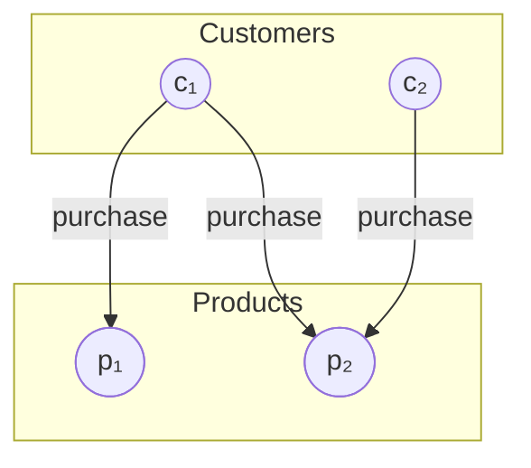

# Carrefour AI Challenge: Product Repurchase Prediction (1st Place)

## 1. Introduction

This report outlines the winning strategy for the Carrefour AI Challenge on Kaggle, a competition aimed at predicting the **top 10 products** customers would repurchase in their first 2024 transaction. The solution leverages historical transaction data from 100,000 customers (2022-2023) and product metadata.

We framed the challenge as a high-dimensional **binary classification problem**: predicting the probability that a given customer would repurchase a specific product they had previously bought. The final ranking for recommendations was derived from these probabilities.

<div class="box-tip" markdown="1">
<div class="title">Core Technologies</div>

-   **Data Processing**: Polars (for performance on large datasets)
-   **Modeling**: AutoGluon (for robust AutoML and ensembling) and PyTorch Geometric (for GNN exploration)
-   **Feature Engineering**: Custom features based on customer behavior, product characteristics, and interaction dynamics
</div>


<div class="box-warning" markdown="1">
<div class="title">Evaluation Metric: HitRate@10</div>

Performance was measured using **HitRate@10**, which calculates the proportion of the 10 recommended products per customer that were actually present in their first 2024 purchase transaction. This metric directly reflects the practical utility of the recommendations.

$$
\text{HitRate@10} = \frac{1}{|U|} \sum_{u \in U} \frac{|\text{Recommended}_{10}(u) \cap \text{Purchased}(u)|}{\min(|\text{Purchased}(u)|, 10)}
$$
    
Where:

$$U$$ 
= set of customers in the test set  
$$\text{Recommended}_{10}(u)$$ = top 10 recommended products for customer u
$$\text{Purchased}(u)$$ = set of products purchased by customer u in their first 2024 transaction

</div>

## 2. Data Processing and Feature Engineering Strategy

Handling the ~87 million transaction records efficiently was paramount. **Polars** provided significant speed advantages over Pandas for data manipulation and joins.

### 2.1 Data Preprocessing

Key preprocessing steps included:
1.  **Format Conversion**: Converting large CSVs to the **Parquet format** significantly improved I/O performance and allowed efficient data typing (e.g., dates to `datetime[ms]`).
2.  **ID Optimization**: Parsing string-based IDs (`Transaction_XYZ`, `Household_ABC`, `Product_123`) into integers reduced memory footprint and accelerated join operations.
3.  **Duplicate Aggregation**: Addressed duplicate entries for the same `(transaction_id, customer_id, product_id)` by aggregating them, typically by summing the `quantity`. This ensured data integrity while consolidating information.
4.  **Feature Selection**: Dropped low-variance or descriptive columns from `products_data` that were unlikely to contribute significantly to the predictive model.

### 2.2 Feature Engineering Overview

The goal was to create informative features capturing customer behavior, product characteristics, and their interactions over time. Instead of focusing on exact formulas, we emphasize the *types* of features generated:

1.  **Customer Profile Features**:
    *   Aggregated metrics summarizing overall purchasing behavior (e.g., total transactions, total quantity).
    *   *Behavioral Scores*: Calculated scores representing tendencies like purchase diversity (`Diversity Score`), sensitivity to promotions (`Promotion Score`), and preference for specific product types like organic (`Bio Score`).

2.  **Product Profile Features**:
    *   Aggregate metrics summarizing product sales patterns (e.g., total sales, number of unique customers).
    *   *Characteristic Scores*: Calculated scores representing product attributes like overall popularity (`Popularity Score`), reliance on discounts (`Discount Score`), and the typical variety of items it's purchased with (`Variety Score`).

3.  **Customer-Product Interaction Features**:
    *   Metrics capturing the specific relationship between a customer and a product (e.g., purchase count, total quantity purchased of *that* product by *that* customer).
    *   *Frequency & Recency*: Calculated features like normalized purchase frequency of a product for a customer, time since the last purchase of that product (`Days Since Last Product Purchase`), and a normalized recency score (`Score Recency`).
    *   Temporal Information: Included timestamps like `Last Purchase Date for Product` and `Last Purchase Date for Customer`.

<details class="details-block" markdown="1">
<summary><strong>List of Key Engineered Features</strong> (Click to expand)</summary>

-   `diversity_score` (Customer)
-   `promotion_score` (Customer)
-   `bio_score` (Customer)
-   `popularity_score` (Product)
-   `discount_score` (Product)
-   `variety_score` (Product)
-   `normalized_frequency` (Interaction)
-   `score_recency` (Interaction)
-   `last_purchase_date_for_product` (Interaction)
-   `last_purchase_date_for_customer` (Customer)
-   `days_since_last_product_purchase` (Interaction)
-   `customer_total_transactions` (Customer)
-   `product_quantity_sum` (Interaction)
-   `customer_quantity_sum` (Customer)
-   `normalized_quantity` (Interaction)
-   Product metadata features (e.g., `category_key`, `brand_key` if kept, `is_promo` flags, price-related features if available/engineered).
-   Date-derived features (e.g., day of week, month - not explicitly mentioned but standard practice).

</details>

This comprehensive feature set aimed to provide the model with rich contextual information for making accurate repurchase predictions.

## 3. Modeling with AutoGluon

The core of our solution involved using **AutoGluon** to tackle the binary classification task.
AutoGluon is an open-source AutoML framework that automates the process of model selection, hyperparameter tuning, and ensembling across various machine learning algorithms.
It is particularly effective for tabular data, making it a suitable choice for this competition.

Here's a diagram illustrating how AutoGluon works:


### 3.1 Target Variable and Problem Setup

-   **Target (`label`)**: A binary variable (1/0) indicating whether a `(customer_id, product_id)` pair from the historical data was repurchased in the `test_data` (first 2024 transaction).
-   **Input Features**: The combination of preprocessed original features and the extensive set of engineered features.

### 3.2 Modeling Strategy and Metric

-   **Why AutoGluon?**: Chosen for its state-of-the-art performance on tabular data, ease of use, and robust ensembling capabilities (stacking, bagging). It automates model selection and hyperparameter tuning across a diverse range of algorithms (Neural Networks, Gradient Boosted Trees like XGBoost, LightGBM, CatBoost).
-   **Optimization Metric (`eval_metric='roc_auc'`)**: The **ROC AUC** score was used for model evaluation and selection during training.
-   **Rationale**: ROC AUC is well-suited for imbalanced datasets (likely many non-repurchased pairs vs. repurchased ones). It measures the model's ability to distinguish between positive and negative classes irrespective of the classification threshold, which is crucial for ranking products by probability.

### 3.3 Training Process

1.  **Data Split**: A customer-based split ensured no overlap between training (Customers 1-70k) and validation (Customers 70k-80k) sets, preventing data leakage.
2.  **Sampling**: To manage computational load, the training was performed on a large sample (15 million rows) of the full training data, strategically sampled to potentially include all positive examples and a representative subset of negative examples.
3.  **AutoGluon Fit**: The `TabularPredictor.fit()` method was invoked with:
    *   `presets='medium_quality'`: Balancing training time and model quality.
    *   `hyperparameters`: Custom configurations for key models (see details below).
    *   `num_bag_folds=3`, `num_stack_levels=2`: Enabling 3-fold bagging and 2 levels of stacking for enhanced robustness and accuracy.
    *   `ag_args_fit={'num_gpus': 1}`: Leveraging GPU acceleration.

<details class="details-block" markdown="1">
<summary><strong>AutoGluon Hyperparameter Configuration Example</strong> (Click to expand)</summary>

```python
# Example hyperparameters passed to predictor.fit()
hyperparameters = {
    # Optimized settings for Neural Network (PyTorch)
    "NN_TORCH": {
        "batch_size": 24576, # Large batch size suitable for GPUs (e.g., 2048 * 12)
        "learning_rate": 3e-4,
        "num_epochs": 300, # Potentially adjusted based on validation performance
        # ... other NN parameters like num_layers, hidden_size, dropout ...
        "ag_args_fit": {"num_gpus": 1} # Ensure GPU usage
    },
    # Example learning rates for Gradient Boosting models
    "GBM": {"learning_rate": 0.1},
    "CAT": {"learning_rate": 0.2}, # CatBoost
    "XGB": {"learning_rate": 0.15}, # XGBoost
}
```

Note: Exact values might have been tuned further during experimentation.

</details>

### 3.4 Model Performance and Ensembling

AutoGluon automatically trains a variety of base models and then combines their predictions using **Weighted Ensembles**. This ensembling approach, often involving multiple levels of stacking, is key to achieving state-of-the-art results on tabular data.

**Validation Performance Leaderboard (Simplified)**

The leaderboard below shows the performance (Validation ROC AUC) of the top models trained by AutoGluon. Higher-level ensembles (denoted by `_L2`, `_L3`, `_L4`) combine predictions from models in the level below.

| Model                    | Validation ROC AUC | Stack Level | Key Algorithm Type      |
| :----------------------- | :----------------- | :---------- | :---------------------- |
| **WeightedEnsemble_L4**  | **~0.853**         | 4           | Ensemble (of L3 models) |
| WeightedEnsemble_L3      | ~0.853             | 3           | Ensemble (of L2 models) |
| XGBoost_BAG_L3           | ~0.853             | 3           | Gradient Boosting (XGB) |
| XGBoost_BAG_L2           | ~0.853             | 2           | Gradient Boosting (XGB) |
| CatBoost_BAG_L3          | ~0.853             | 3           | Gradient Boosting (Cat) |
| LightGBM_BAG_L3          | ~0.852             | 3           | Gradient Boosting (LGBM)|
| WeightedEnsemble_L2      | ~0.852             | 2           | Ensemble (of L1 models) |
| NeuralNetTorch_BAG_L2    | ~0.852             | 2           | Neural Network (NN)   |
| *(... other base models L1)* | *...*              | 1           | *Various Base Models*   |

*Note: ROC AUC scores are approximate based on the notebook/report output.*

> **Key Finding:** The highest performance was consistently achieved by the top-level **Weighted Ensemble** (`WeightedEnsemble_L4`). This highlights the effectiveness of AutoGluon's stacking strategy, which leverages the diverse predictions from strong base models (like XGBoost, CatBoost, LightGBM, and Neural Networks, further enhanced by bagging).
{: .prompt-info }

> **Ensemble Benefit:** Combining multiple models through weighted ensembling reduces prediction variance, mitigates the weaknesses of individual algorithms, and ultimately leads to more robust and accurate final predictions compared to relying on any single model.
{: .prompt-info }

### 3.5 Feature Importance Summary

An analysis of feature importance using AutoGluon's built-in methods (`predictor.feature_importance()`) indicated that the model relied most heavily on:

*   **Interaction Frequency & Recency Features**:
    *   `normalized_frequency`
    *   `score_recency`
    *   `days_since_last_product_purchase`
*   **Product Characteristics & Popularity**:
    *   `popularity_score`
    *   `subclass_key` (and other category keys like `department_key`, `class_key`)
    *   `variety_score`
*   **Customer Activity**:
    *   `customer_total_transactions`

This confirms that understanding *how often* and *how recently* a specific customer interacted with a product, combined with the product's general appeal and category, were crucial for predicting repurchase.

## 4. Prediction and Evaluation

The final phase involved using the trained AutoGluon predictor to generate recommendations for the test set and evaluating the performance.

### 4.1 Generating Top-10 Recommendations

The process to create the final submission file was as follows:

1.  **Predict Probabilities**: We used `predictor.predict_proba(test_features)` to get the probability of repurchase (`label=1`) for all relevant `(customer_id, product_id)` pairs in the test dataset. Using probabilities allows for fine-grained ranking, which is essential for a top-k recommendation task.
2.  **Rank Products per Customer**: For each unique `customer_id`, we sorted the associated products based on their predicted repurchase probability in descending order.
3.  **Select Top 10**: We selected the `product_id`s corresponding to the 10 highest probabilities for each customer.
4.  **Format Submission**: The final submission file was created containing `customer_id`, `product_id`, and `rank` (from 1 to 10).

### 4.2 Final Results

*   **Validation Performance**: On our internal validation set (customers 70,001 to 80,000), this methodology achieved a **HitRate@10 of 0.383**. This score provided strong confidence in the model's ability to identify relevant repurchases before final submission.
*   **Kaggle Competition Outcome**: Applying the same prediction generation process to the official hold-out test set resulted in our team achieving **1st Place** in the competition. This confirms the effectiveness and generalization capability of our chosen approach.


## 5  Exploration with Graph Neural Networks (GNN)

> Even though the AutoML ensemble delivered the #1 score, we investigated a **Graph Neural Network** approach as a promising research line.  
{: .prompt-warning }

### 5.1 Motivation  

A customer–product purchase history can naturally be represented as a **bipartite graph**.  
Graph Neural Networks can propagate information along such purchase links, enabling *collaborative filtering* effects that classic tabular models struggle to capture.

- **Nodes**:  
  - Customer nodes with behavioural features (total orders, promotion ratio, diversity score, …).  
  - Product nodes with catalogue features (popularity, category, discount ratio, …).

- **Edges**:  
  - Undirected edge `customer ↔ product` if the customer bought the product *at least once*.  
  - Binary edge label $y_{cp} ∈ {0,1} — 1$ if that customer re-purchased the product during 2024, $0$ otherwise.

### 5.2 Graph Construction  




```python
# PyTorch Geometric data preparation (simplified)
import torch
from torch_geometric.data import Data

# node feature matrices
x_customers = torch.tensor(customer_features, dtype=torch.float)
x_products  = torch.tensor(product_features,  dtype=torch.float)
x           = torch.cat([x_customers, x_products], dim=0)

# edge index (2 × E) – customer & product indices
edge_index = torch.tensor([customer_idx, product_idx], dtype=torch.long)

# binary labels for each edge
edge_label = torch.tensor(labels, dtype=torch.float)

data = Data(x=x, edge_index=edge_index, edge_label=edge_label)
```

### 5.3 Model Architecture  

We used **PyTorch Geometric** (`torch_geometric` ≥ 2.5) with a lightweight 2-layer **GraphSAGE** encoder:

$$
\mathbf{h}^{(k+1)}_v \;=\;
\sigma\!\Bigl(
 \mathbf{W}^{(k)}
 \bigl[\,
     \mathbf{h}^{(k)}_v \;||\;
     \text{AGG}\_{\;u\in\mathcal{N}(v)} \mathbf{h}^{(k)}_u
 \bigr]
\Bigr),
$$

where $\mathbf{h}^{(0)}_v$ is the initial node feature vector and `AGG` = mean aggregation.  
Final edge logits are computed by a dot-product decoder:

$$
\hat{y}_{cp} \;=\; \sigma\!\bigl(\, \mathbf{h}_c^{(K)} \cdot \mathbf{h}_p^{(K)} \bigr).
$$

```python
from torch_geometric.nn import SAGEConv
import torch.nn.functional as F

class BipartiteGNN(torch.nn.Module):
    def __init__(self, in_dim, hidden_dim):
        super().__init__()
        self.conv1 = SAGEConv(in_dim, hidden_dim)
        self.conv2 = SAGEConv(hidden_dim, hidden_dim)

    def encode(self, x, edge_index):
        h = F.relu(self.conv1(x, edge_index))
        h = self.conv2(h, edge_index)
        return h

    def decode(self, h, edge_index):
        src, dst = edge_index
        return (h[src] * h[dst]).sum(dim=-1)   

    def forward(self, data):
        h = self.encode(data.x, data.edge_index)
        return self.decode(h, data.edge_index)
```

### 5.4 Training Details  

| Parameter                  | Value |
|--------------------------- |------:|
| Loss                       | Binary cross-entropy |
| Hidden dimension           | 64 |
| Optimizer / LR / Epochs    | Adam – 1 e-3 – 10 epochs |

### 5.5 Results & Lessons Learned  

| Metric (validation) | AutoGluon Ensemble | GNN (GraphSAGE 2-layer) |
|---------------------|-------------------:|------------------------:|
| ROC-AUC            | **0.853** | 0.823 |
| HitRate @ 10       | **0.383** | 0.321 |

*Why did the GNN under-perform?*

* **Model complexity** – larger depth/width harmed generalisation, smaller models lacked capacity.  
* **Scale** – 100 k customers × 100 k products → ~1 M edges. Full-batch training is memory-heavy; mini-batch neighbour sampling improved RAM usage but added variance.  
* **Time budget** – extensive hyper-parameter search was infeasible within the competition window.

> **Take-away — promising but not yet optimal.** With more time, hierarchical sampling, heterogeneous GNN operators, or a joint GNN + tabular ensemble could close the gap.
{: .prompt-info }


## 5. Conclusion

Our success in the Carrefour AI Challenge stemmed from a combination of efficient data processing, strategic feature engineering, and the application of a powerful AutoML framework.

**Key Success Factors:**

*   **Efficient Data Handling**: Utilizing **Polars** and the **Parquet** format was crucial for managing the dataset's scale.
*   **Insightful Feature Engineering**: Creating features that captured customer profiles, product characteristics, interaction dynamics (frequency, recency), and temporal aspects provided rich input for the model.
*   **Robust Modeling with AutoGluon**: Leveraging AutoGluon's automated **ensembling** (stacking and bagging) across diverse, well-tuned base models maximized predictive accuracy and robustness.
*   **Strategic Metric Choice**: Optimizing for **ROC AUC** during training proved effective for handling the inherent class imbalance and producing well-ranked probabilities necessary for the final **HitRate@10** evaluation.
*   **Probability-Based Ranking**: Using `predict_proba` allowed for precise ranking to select the most likely top-10 candidates for repurchase.

This project underscores the potential of combining modern data tools like Polars with advanced AutoML solutions like AutoGluon to tackle complex, large-scale recommendation challenges effectively in a real-world retail context. Potential future improvements could involve exploring graph-based features or more intricate time-series modeling techniques.

We extend our gratitude to Carrefour and the University of Bordeaux for organizing this stimulating and practical competition.
